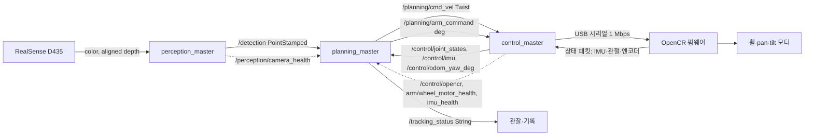
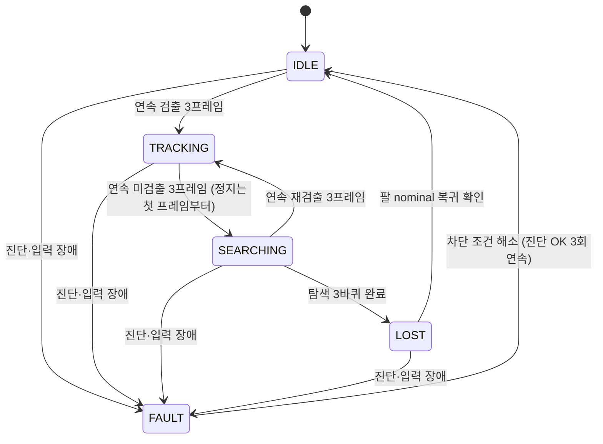

# Lv2 모듈5 프로젝트 1 — 비전 객체 추적 시스템 보고서 (Live.Eat)

> 작성 기준: 2026-10-08 로컬 작업 트리 (`lv2_module5/`). 기준 코드: 브랜치 `control_fault_inject_Kwonhyeokmu`(238e52b)와 `planning_csv_log_Kwonhyeokmu`(94f856b)의 병합본. 로봇에는 git이 없어 회차마다 `results/logs/<run>/code_fingerprint.txt`(실행 코드 sha256)를 남겼다
>
> **표기 규칙**
> - 저장소에 원본 기록이 있는 수치만 본문에 적었다. 출처 파일 경로를 함께 적는다.
> - 저장소에서 원본을 찾지 못한 항목은 아래처럼 **[로그 필요]** 로 표시했다. 로그를 `results/`에 넣고 빈칸(`____`)을 채운 뒤 표시를 지운다.
>
> > [!IMPORTANT]
> > **[로그 필요]** 예시 — 이 상자가 남아 있으면 해당 결과는 아직 증빙되지 않은 상태다.

---

## 0. 개요

### 0.1 목표와 범위

| 항목 | 발제 기본 | 우리 팀 구현 |
|---|---|---|
| 대상 | 단일 색상 목표 1개 | 파란색 퍽(Puck) 1개 |
| 검출 | HSV·Contour | **YOLO26n 단일 클래스 학습 모델 (NCNN, 입력 320x192, 10/8 실기)** — 1.2절 사유 참고 |
| 카메라 | USB 카메라 | Intel RealSense D435 (color + aligned depth) |
| 구동 | 다이나믹셀 수평 1축 | TurtleBot3 Waffle Pi 차체(휠 2) + 2DOF 팔(pan·tilt) |
| 추적 | 수평 1축 P 추적 | 차체 yaw P 제어 + pan 분배 + 거리 P 제어(목표 0.40 m) |
| 상태 | IDLE / TRACKING / LOST | IDLE / TRACKING / SEARCHING / LOST / FAULT |
| 안전 정지 | 미검출·입력 타임아웃·보드 통신 타임아웃 | 동일 + 센서/모터 진단(health) 기반 FAULT |

### 0.2 실행 환경

| 항목 | 값 | 출처 |
|---|---|---|
| SBC | Raspberry Pi 4 Model B Rev 1.5 (RAM 4 GB) | `results/realtime_ncnn_vs_onnx.md` 1절 |
| OS / 커널 | Ubuntu 26.04.1 LTS / 7.0.0-1020-raspi | 〃 |
| ROS 2 | **Lyrical** (발제 기본 Humble과 다름) | 〃 |
| 카메라 드라이버 | realsense2_camera 4.58.4, `align_depth.enable:=true`. 10/5 속도 측정: color·depth 640x480 @ 15 FPS / 10/8 실기 시험: color 640x360 (`RAW-01` bag 기준, 19.0 s 동안 542프레임 ≈ 28.5 Hz) | `results/realtime_ncnn_vs_onnx.md`, `RAW-01` |
| 추론 | NCNN `f947448` (Vulkan OFF). 10/8 실기: 모델 `target_blue_v4_192`, 입력 320x192, 스레드 2. 10/5 속도 측정(1.5절): 모델 `target_blue_256`(md5 `4ceb5c3d…`), 입력 320x256, 스레드 3 | `config/perception.yaml`, `results/README.md` 0절, `ros2_ws/src/perception/README.md` |
| MCU | OpenCR, USB 시리얼 1,000,000 baud, 펌웨어 루프 100 Hz | `firmware/opencr_firmware/opencr_firmware.ino` |
| 휠 모터 | XM430-W210-T (Waffle Pi) | `config/control.yaml` |
| 팔 모터 | XM430-W350-T, Position 모드 | `config/control.yaml` |
| 다이나믹셀 ID·통신 | 휠 L=1, R=2 / 팔 yaw=11, pitch=12. 다이나믹셀 baud 1,000,000, 프로토콜 2.0 (OpenCR `Serial3`) | `firmware/opencr_firmware/motor_driver.cpp` (실제 사용한 설정값) |
| Pi 방열판·팬 | Raspberry Pi 4와 TurtleBot3 Waffle Pi 교구를 구성 그대로 사용(팀 설명). 방열판·팬 유무는 기록 없음 | `results/realtime_ncnn_vs_onnx.md` 166행 |
| 개발 PC 검증 | ROS 2 Jazzy (빌드·단위시험·가상 노드 시뮬레이션) | `results/pipeline_validation/README.md` |
| OpenCV 버전 | 개발 PC 빌드 4.6.0 (`ros2_ws/build/perception/CMakeCache.txt`). Pi 실기 버전은 확인하지 못함 | 〃 |

> [!NOTE]
> **[기입 필요]** 다이나믹셀 ID·baud·프로토콜은 실기에서 사용한 저장소 설정값이다. DYNAMIXEL Wizard 캡처 같은 별도 스캔 기록은 첨부하지 않았다. Pi의 OpenCV 버전과 방열판·팬 유무는 기록이 없다. Pi 4와 Waffle Pi 교구는 개조 없이 구성 그대로 썼다.

### 0.3 시험 계획 (시험 전 확정 조건)

| 시험 | 조건 | 반복 | 판정 |
|---|---|---|---|
| 검출 3장면 | 정상 / 대상 없음 / 일부 가림, 같은 설정 | 각 1장면 이상 | 검출·미검출 출력 일치 |
| 모의 입력 | 모터 출력 끔(`motor_enable:=false`), 5종 입력 | 각 1회 | 2.4절 기대 결과 |
| Kp 비교 | `waffle_yaw_gain` 2값, 왼3s→중앙3s→오른3s→중앙3s | 값별 3회 (총 6회) → **미수행, 주행 실험으로 대체(3.3절)** | RMSE·흔들림·응답 |
| 정상 추적 | 동일 조건 30초 이상 | 1회 | FPS·검출률·RMSE |
| 가림 후 재등장 | 약 2초 가림 후 시야 내 재등장 | 5회 | 3초 이내 TRACKING 복귀 |
| 인지 입력 중단 | perception 노드 종료로 `/detection` 발행 중단 | 1회 이상 | 0.5 s 후 FAULT(`detection_timeout`), 차체 정지 |
| 제어 통신 중단 | control_master 종료 또는 USB 분리 | 1회 이상 | OpenCR watchdog 0.3 s 후 휠 정지 |
| bag 재현 | 성공·소실 장면 각 10~30초 | 각 1개 | 입력 재처리 / 결과 재분석 |

### 0.4 산출물 위치 (시나리오 ID ↔ 보고서 절)

대용량 bag·영상은 Google Drive [LiveEat_drive_upload](https://drive.google.com/drive/folders/1R_BAn832ETpi6gQRwt-JQcdjtKF2fso_)에 두었다. 하위 폴더는 [bags/](https://drive.google.com/drive/folders/1agXXtHNVBnV_OLNs3LGtfcx3fi1v2G26)와 [videos/](https://drive.google.com/drive/folders/18OlJ7TTO0A09JVpiO2owk4gIyUHeZk5F)이고, 파일 전체의 해시는 [SHA256SUMS.txt](https://drive.google.com/file/d/1b2mOXKbh8UQJ8QRdMfyRnLCiME3N8DyL/view)에 있다. 시나리오 ID는 팀 Notion 실험 계획서(「제출전 체크사항 및 필요 실험 정리 TODO(최종)」)의 ID와 같다. bag은 모두 `.mcap` + `metadata.yaml` 구성이다.

| 시나리오 ID | 시험 | 보고서 절 | bag | 영상 |
|---|---|---|---|---|
| M-IN1~5 | 모의 입력 5종 (모터 출력 끔) | 2.4 | [IN-02](https://drive.google.com/drive/folders/1gwRmVpIxXZRrF5UBZ3m_y-K0jDFg6LGW) (참고: [IN-01](https://drive.google.com/drive/folders/1vFD1qZzbSlB5NF_fGNhyK8RorMcAiHuO) — 팔 각도를 맞추지 않고 시작한 회차) | — |
| M-T1~8 | 상태 전이 | 4.1, 4.6 | [M-T_split/M-T1~M-T8](https://drive.google.com/drive/folders/180zme9cNj5Y73fyxuvDJi-DIwXNYKGur) (분할 전 원본: [M-T_SC-01](https://drive.google.com/drive/folders/1Ig-_IjuP2jSYe6q3AsVYLmQ4pzNScoV4), [M-T_SC-01b](https://drive.google.com/drive/folders/1lxFP30PxVpc-lvRoJ_sp5b0POlzuDBOh)) | M-T01~M-T08.mp4, [DEMO_녹화명령재생_M-T1-8.mp4](https://drive.google.com/file/d/12DLur_tuNgAXsoGmz3OZ0ez65ALdRxmo/view) |
| M-R1 | 2초 가림 후 재등장 5회 | 4.3 | [R1-02](https://drive.google.com/drive/folders/1JTNpwvH_EZKLtq8XyLxZrqdHyIzfk3sF), [R1-03](https://drive.google.com/drive/folders/1gTIbDqHIXKGF047DgP9S-5mGD-oR-B6m), [R1-04](https://drive.google.com/drive/folders/1y_o9oRo5IJlqGrh_XzAGZd2SEevRoPXu), [R1-05](https://drive.google.com/drive/folders/1WvtslPvsUKA2gf9DvvEZO4hpsdpvFhtC), [R1-06](https://drive.google.com/drive/folders/1c5O8T_jUZ_GZ83esHm6Rt2ITkj9pK4Lj) | — |
| M-C1 (= M-T7) | 인지 입력 중단 | 4.2 | [M-T_split/M-T7](https://drive.google.com/drive/folders/180zme9cNj5Y73fyxuvDJi-DIwXNYKGur) | [M-T07.mp4](https://drive.google.com/file/d/11FMsLU4at6_ggJUjL2YgJUAgwWOIWxdN/view) |
| M-C2 | 제어 통신 중단 | 4.2 | [M-C2](https://drive.google.com/drive/folders/1Sa4egu5d0UHMe2F21s_skCfBKU79CPFi) | — |
| M-B0, M-FPS | 30초 정상 추적, FPS·RMSE | 4.2, 4.4 | [B0-01](https://drive.google.com/drive/folders/1O-hXG158f6-j018Qfhy8S6XxSCdNUi2c) | — |
| M-BAG | 성공 장면 bag | 5.1 | [BAG-OK](https://drive.google.com/drive/folders/1o5h3wPhevLEFdfUBpXCOHOzpVA5r9-PR), [BAG-OK_success_trim](https://drive.google.com/drive/folders/19IVRoVpKWB5BI4a9-e-vQ_rom_-hOmKT) | [BAG-OK_success.mp4](https://drive.google.com/file/d/1eRzNMHlnuh6-AiWAtCBmZb8wPdnYb8Wa/view) |
| M-BAGL | 소실·복귀 장면 bag | 5.1 | [BAG-LOST](https://drive.google.com/drive/folders/1JQSXHx2B8wGZa5LMTz-y7HnoD1M3Ry6k) | — |
| M-RE1 | 결과 재분석 | 5.2 | [B0-01](https://drive.google.com/drive/folders/1O-hXG158f6-j018Qfhy8S6XxSCdNUi2c) | — |
| M-RE2 | 입력 재처리 | 5.2 | [RE2-01](https://drive.google.com/drive/folders/1ZRYRvDS2WBhwOxgBTDz5AaYDBNk5LFlp), [RAW-01](https://drive.google.com/drive/folders/1bsHlNiqybI6UgAPSLZvUHxnSiJdz_uoN) | — |

- 시나리오가 확인되지 않은 영상: [IMG_9507.MOV](https://drive.google.com/file/d/1aTZo7afZjS9erdRefKWLEw8LbeSr9c2U/view), [IMG_9508.MOV](https://drive.google.com/file/d/1tMgXwPWhuvFz2dRJAGhM3X-7gK6MyjoN/view). 어떤 시험인지 확인해 위 표에 넣는다.
- `RAW-01`이 `RE2-01`의 입력(영상 포함 원본 bag)인지는 계획서에 적혀 있지 않다. 확인 후 5.2절에 적는다.
- 팀원 PC의 시험 로그(control CSV, runs.csv, note.md)는 계획서상 `experiment_logs/<run_id>/`에 있다. 저장소 `results/`로 옮기는 작업이 남아 있다.

---

## 1. 문제 1 — 검출 파이프라인 (성취도 41)

### 1.1 구현 내용

- 노드: `ros2_ws/src/perception/src/perception_master.cpp` (`on_frames` → `process`)
- 검출기: `detector.cpp`, `detector_factory.cpp`, `ncnn_detector.cpp` (비교용 `onnx_detector.cpp`)
- 거리: `depth_extractor.cpp` — bbox 중앙 ROI(`depth_roi_ratio` 0.4)의 유효 depth 중앙값
- 설정 분리: `config/perception.yaml` (모델·입력 크기·confidence·depth 범위·토픽), `config/camera.yaml`

처리 순서:

```
RGB + aligned depth 수신 → ApproximateTime 동기화(sync_slop 0.02 s)
→ letterbox·정규화 → YOLO 추론(NCNN, 10/8 실기 320x192·스레드 2 / 10/5 측정 320x256·스레드 3)
→ confidence ≥ 0.25 후보 중 최고 점수 1개 선택 (target_class: -1)
→ bbox 중심 (cx, cy) → ex = (cx − W/2)/(W/2), ey = (cy − H/2)/(H/2)  (오른쪽·아래 +)
→ bbox 중앙 ROI depth 중앙값 (0.2~3.0 m, 유효 비율 ≥ 0.5)
→ /detection 발행 (header.stamp = 원본 color 영상 stamp)
```

미검출 처리: 검출이 없으면 `x = y = z = 0`을 그 프레임에 바로 발행한다. 이전 좌표를 재사용하지 않는다 (`perception_master.cpp` 265행). 검출은 됐지만 depth가 유효하지 않아도 `z = 0`이다 (263행).

### 1.2 HSV·Contour 대신 YOLO를 쓴 사유

- 우리 과제의 목표는 바닥 위 퍽까지 **거리를 유지하며 따라가는 것**이다. 차체가 움직이면 조명·배경·거리(0.2~3 m)가 계속 바뀐다. 고정 HSV 임계값은 이런 변화에 다시 조정해야 하는 경우가 많아, 단일 클래스 YOLO를 학습했다.
- 학습: `perception_test/yolo/` — `yolo26n.pt`를 기반으로 직접 라벨링한 데이터로 학습했다(`runs/target_blue/weights/best.pt`). 학습 기록은 아래 표와 같다.
- 10/8 실기에 쓴 배포 모델은 NCNN `target_blue_v4_192`(입력 320x192)이다. 1.5절 속도 측정(10/5)은 구버전 `target_blue_256`(320x256)로 했다.
- **발제 필수인 HSV·Contour 경로는 배포 노드에 구현하지 않았다.** 7절 한계에 적었다.

| 항목 | 값 |
|---|---|
| 라벨링 도구 | makesense.ai |
| 이미지 수 | 628장. 학습:검증 약 9:1로 나눴다(팀 기억 기준, 정확한 장수는 기록 없음. 9:1이면 학습 약 565장, 검증 약 63장) |
| 학습 입력 크기 | 320 x 192 (10/8 배포 모델 `target_blue_v4_192`와 같음) |
| best epoch | 63 |
| mAP50 | 0.990 |

> [!NOTE]
> **[기입 필요]** 위 값은 팀이 전달한 학습 요약이고 `results.csv`·`results.png` 원본은 첨부하지 않았다. 정확한 학습/검증 장수와 검증 데이터가 학습 장면과 겹치는지는 기록이 없다. mAP50 0.990은 같은 장면 기반 검증값일 수 있어 일반화 성능으로 읽지 않는다(추정).

### 1.3 실행 조건

| 항목 | 값 |
|---|---|
| 해상도 | 카메라 640x480 @ 15 FPS, 모델 입력 320x256 (10/5 측정 모델 기준) |
| confidence | 0.25 |
| depth 유효 범위 | 0.2 ~ 3.0 m, `min_valid_ratio` 0.5 |
| 후보 선택 | 최고 score 1개 |
| 실행 | `./scripts/run_perception.sh` |

### 1.4 결과물 — 3장면

출처: bag [BAG-LOST](https://drive.google.com/drive/folders/1JQSXHx2B8wGZa5LMTz-y7HnoD1M3Ry6k)의 `/camera/color/jpeg`(640x360)와 시각이 가장 가까운 `/detection` 메시지(차이 36~59 ms). 검출 이미지의 초록 원은 `/detection`의 (x, y)를 영상 좌표로 되돌린 중심, 흰 십자는 영상 중심이다. bag에는 bbox·confidence가 없어 표시하지 못했다.

| 장면 | 원본 | 검출 결과 (중심·영상 중심) | `/detection` 출력 | bag 시각 |
|---|---|---|---|---|
| 정상 | `results/images/scene_normal_raw.jpg` | `results/images/scene_normal_det.jpg` | ex=-0.216, ey=-0.053, z=0.563 m | 3.03 s |
| 대상 없음 | `results/images/scene_none_raw.jpg` | `results/images/scene_none_det.jpg` | x=y=z=0 | 29.83 s |
| 일부 가림 | `results/images/scene_occluded_raw.jpg` | `results/images/scene_occluded_det.jpg` | ex=0.006, ey=-0.025, z=0.418 m | 14.03 s |

- 일부 가림 장면은 손이 블록 대부분을 가렸는데도 검출된 프레임이다. 0.2 s 뒤(14.22 s)에는 완전히 가려져 z=0이 되었다.
- 같은 bag의 21.23 s(z=0.37)와 29.43 s(z=0.99, 화면 가장자리)에는 블록이 보이지 않는데 검출이 찍힌 프레임이 있다. 4.4절 사람 대조(0/10)는 시각이 맞는 10프레임만 본 것이라 이 프레임들이 대조 대상이었는지는 확인하지 못했다.

### 1.5 측정 결과 — 처리 속도 (Pi 4, 실제 노드)

출처: `results/realtime_ncnn_vs_onnx.md` 2.6절, 원본 `results/logs/controlled_320b/`. 고정 장면(퍽 약 1.1 m), 75초 실행 중 처음 15초 제외.

| 백엔드 | 입력 | 스레드 | 프레임 | infer mean [ms] | infer p95 [ms] | 발행 FPS | CPU |
|---|---|---|---|---|---|---|---|
| **NCNN (10/5 배포)** | **320x256** | **3** | 394 | **103.6** | **151.3** | **6.88** | 201% |
| NCNN | 320x256 | 4 | 332 | 131.6 | 193.3 | 5.84 | 243% |
| ONNX | 320x256 | 4 | 257 | 119.8 | 217.5 | 4.49 | 257% |
| NCNN | 640x480 | 4 | 116 | 467.2 | 739.3 | 2.08 | 269% |

- 발행 FPS = (프레임 수 − 1) / 분석 구간 첫·마지막 `header.stamp` 간격. 카메라 설정 FPS(15)와 다르다.
- 이 고정 장면에서는 네 실행 모두 검출 100%, depth 실패 0이었다. **이 값은 노드의 detected 비율이지 사람이 대조한 검출률이 아니다.**

### 1.6 해석

- 처리 시간의 97% 이상이 추론이다. 입력 크기를 640x480 → 320x256으로 줄인 효과(−72%)가 백엔드 차이(0~5%)보다 훨씬 크다.
- 스레드 4개가 3개보다 느렸다. 카메라 노드(depth 정렬)와 CPU를 다투는 것으로 보았다(추정, 미확인).
- 640 입력의 1.3 m 장면에서는 depth 실패가 36~72%였다(같은 문서 2.4절). depth 실패도 `z = 0`이라 planning에는 미검출로 보인다. 320x256 1.1 m 장면에서는 실패가 없었다. 거리별 재확인이 필요하다.

### 1.7 심화 (조명·거리 변화)

미수행. 320x256 모델은 1.1 m 한 거리에서만 확인했다.

---

## 2. 문제 2 — 인지·제어 노드 연결 (성취도 42)

### 2.1 노드 구조



| 노드 | 책임 |
|---|---|
| perception_master | 영상 동기화, 검출, 정규화 오차·depth 계산, 카메라 진단 |
| planning_master | 입력 신선도·진단 검사, 상태 머신, 목표 위치 계산, 차체 속도·팔 목표 생성 |
| control_master | 속도·가속도·관절 제한, 휠 운동학, 명령 timeout, 시리얼 송수신, 장치 진단 |
| OpenCR 펌웨어 | 패킷 검증, watchdog, 모터 읽기·쓰기, IMU |

실행: `ros2 launch lv2_module5/launch/bringup.launch.py` (perception + planning + control).

### 2.2 인터페이스 정의 (구현 기준)

| 항목 | 규약 | 근거 |
|---|---|---|
| 목표 토픽 | `/detection`, `geometry_msgs/msg/PointStamped` | `config/planning.yaml` `detection_topic` |
| point.x / y | 정규화 중심 오차 ex / ey, 오른쪽·아래 + | `perception_master.cpp` 머리 주석 |
| point.z | **광축 depth [m]**, 0 = 미검출 또는 depth 실패 | 〃 263·265행 |
| header.stamp | 원본 color 영상 stamp 유지 | 〃 271행 |
| 발행 | 동기화된 영상 쌍마다 1회, 미검출도 z=0 발행 | 〃 |
| QoS | best-effort, depth 1 (발행·구독 동일) | `perception_master.cpp` 113행, `planning_master.py` 128~134행 |
| 상태 | `/tracking_status`, `std_msgs/String`. 예: `LOST\|IMU_TIMEOUT reason=mcu_fault heading=none` | `config/planning.yaml` |
| 차체 명령 | `/planning/cmd_vel` Twist, linear.x [m/s] · angular.z [rad/s], 30 Hz | 〃 `control_rate_hz` |
| 팔 명령 | `/planning/arm_command` Float32MultiArray `[pan, tilt]` 절대각 [deg] | 〃 |
| 정지 명령 | Twist 0, 팔은 현재 목표 유지(또는 FAULT 시 `fault_arm_pose`) | `planning_master.py` |
| 인지 입력 timeout | 0.5 s (`detection_timeout_s`, 발제 기본값) | `config/planning.yaml` |
| control 명령 timeout | 0.3 s (`cmd_timeout_s`, `arm_cmd_timeout_s`) | `config/control.yaml` |
| OpenCR watchdog | 0.3 s (`CMD_TIMEOUT_MS`) | `firmware/opencr_firmware/watchdog.cpp` |

### 2.3 발제 규약과의 대응

| 발제 `/target` | 우리 `/detection` | 차이와 이유 |
|---|---|---|
| 토픽 `/target` | `/detection` | 이름만 다름. `run_perception.sh output_topic:=/target`으로 바꿀 수 있음 |
| x, y = ex, ey | 동일 | 산식·부호 동일 |
| z = 면적비, 0 = 미검출 | **z = depth [m]**, 0 = 미검출·depth 실패 | 거리 유지 제어(목표 0.40 m)에 실제 거리가 필요해 면적비 대신 depth를 넣음. "z = 0이면 x·y로 제어하지 않음" 규칙은 같음 |
| stamp = 원본 영상 시각 | 동일 | |
| best-effort, depth 1 | 동일 | |
| timeout 0.5 s | 동일 | |

### 2.4 모의 입력 시험 (모터 출력 끔)

조건: 모터 출력 끔(`motor_enable:=false`, `camera:=false`), `/detection`에 약 20 Hz로 구간마다 약 10 s씩 직접 발행. z > 0 입력은 depth 값이므로 IN-02에서는 `z = 0.40` (m, 목표 거리와 같아 직진 명령 0, yaw만 확인)을 썼다(IN-01은 `z = 1.0`). 발제 예시처럼 면적비(예: 0.05)를 넣으면 유효 depth 범위(0.2~3.0 m) 밖이라 미검출과 같게 처리된다. z = 0과 발행 중단은 x = +0.4 입력으로 TRACKING을 만든 뒤 바꿨다. 시각은 IN-02 bag 시작 기준 [s]이다.

| 입력 | 기대 결과 | 실제 명령 (`/planning/cmd_vel` angular.z) | 실제 상태 | 판정 |
|---|---|---|---|---|
| x = 0, z = 0.40 | 불필요한 회전 없음 (yaw 데드밴드 3°) | 8.75~18.72 s: ω −0.001~0.000 (평균 0.000), v = 0 | FAULT(시작 시 입력 없음) → 8.79 s IDLE → 8.89 s TRACKING | 통과 |
| x = +0.4, z = 0.40 | 오른쪽 오차를 줄이는 방향 (ω < 0) | 18.77~28.75 s: ω −0.202~−0.200 (평균 −0.200), pan 목표 −6.99° | TRACKING | 통과 |
| x = −0.4, z = 0.40 | 반대 방향 (ω > 0) | 28.80~38.78 s: ω +0.200~+0.201 (평균 +0.201), pan 목표 +6.81° | TRACKING | 통과 |
| z = 0 (x = +0.4 유지) | 이전 목표를 쫓지 않고 정지 | 41.866 s 첫 z = 0 → 다음 명령(41.885 s, +19 ms)부터 v = ω = 0 | 41.985 s SEARCHING (+0.12 s, 미검출 3프레임) 후 설계대로 0.8 rad/s 탐색 회전 | 통과 |
| 발행 중단 | 0.5 s 후 FAULT(`detection_timeout`), 차체 정지, 팔 `fault_arm_pose` [0, 0]° | 마지막 입력 50.879 s → FAULT 51.385 s (Δ 0.505 s), 이후 v = ω = 0, 팔 명령 [0, 0]° | FAULT\|DETECTION_TIMEOUT | 통과 |

산출물: M-IN1~5 → bag [IN-02](https://drive.google.com/drive/folders/1gwRmVpIxXZRrF5UBZ3m_y-K0jDFg6LGW) (`0_bag_2026_10_08-02_18_50.mcap`, sha256 `822f02cd…`). [IN-01](https://drive.google.com/drive/folders/1vFD1qZzbSlB5NF_fGNhyK8RorMcAiHuO)은 팔 각도를 맞추지 않고 시작해 다시 한 회차라 참고용이다.

- 부호 확인: x = +0.4에서 ω < 0(시계 방향, 오른쪽으로 회전), x = −0.4에서 ω > 0이고 크기가 같다(0.200 / 0.201 rad/s). pan 목표도 반대 부호로 대칭이다(−6.99° / +6.81°).
- 모든 구간의 판정은 위 기대 결과와 일치했다.

> [!NOTE]
실행 명령: `python3 tools/inject/mock_inputs.py [depth_m, 기본 0.4]`. `ros2 topic pub`이 아니라 이 스크립트가 `/detection`에 20 Hz로 48 s 동안 다섯 입력을 순서대로 발행했고(z = 0.4 m), 구간 시작마다 `/inject/event`를 냈다. 인수를 바꿨는지는 기록이 없다.

### 2.5 해석

- **부호가 반대일 때:** 오른쪽 목표(ex > 0)에 반시계 회전(ω > 0)을 내면 오차가 커져 목표가 화면 밖으로 밀려난다. 그래서 2.4절의 ±0.4 입력과 3.2절 방향 확인을 먼저 한다.
- **미검출과 토픽 침묵의 구분:** 미검출은 `z = 0` 메시지가 계속 오는 상태이고, 침묵은 메시지가 0.5 s 이상 오지 않는 상태다. planning은 미검출이면 `miss_streak`를 센다(첫 프레임부터 정지, 3프레임 뒤 SEARCHING). 침묵이면 `check_health`가 `detection_timeout`으로 판정해 FAULT로 보내고, 차체 정지와 팔 `fault_arm_pose` [0, 0]°를 발행한다(`planning_master.py` `check_health`). 즉 미검출은 정상 상태 머신 안의 동작이고, 침묵은 장애다. 카메라 고장은 별도로 `/perception/camera_health`의 `frames stopped`, `color frozen` 등으로 보고한다.

---

## 3. 문제 3 — 객체 중심 기반 추적 제어 (성취도 43)

### 3.1 구현 내용

- 코드: `planning_master.py` — `calc_tracking_targets`, `distribute_tgt_yaw_deg`, `calc_waffle_angular_vel`, `calc_waffle_linear_vel`, `wheel_align`
- 제한: `control_master.cpp`, `base_kinematics.cpp`, `arm_command.cpp`, 펌웨어 `motor_driver.cpp`

수평(yaw) 축 제어 흐름:

1. ex와 depth, 영상 stamp 시점의 pan·tilt 자세로 목표의 차체 기준 방위각을 계산한다.
2. 목표 방위각을 차체 몫과 pan 몫으로 나눈다(`pan_yaw_weight` 0.5). pan 한계를 넘는 나머지는 차체 몫에 더한다.
3. 차체 각속도는 P 제어로 만든다.

```
ω = clamp( waffle_yaw_gain × θ_waffle[rad], −1.665, +1.665 )  [rad/s]
```

`waffle_yaw_gain`이 이 보고서의 **Kp**다(단위 1/s, 기본 0.8). 회전 방향은 ROS 규약(반시계 +)이고, 오른쪽 목표(ex > 0)는 ω < 0이 된다.

| 제한·설정 | 값 | 위치 |
|---|---|---|
| 차체 각속도 상한 | 1.665 rad/s (planning), 1.82 rad/s (control) | `planning.yaml`, `control.yaml` |
| 각가속도 상한 | 3.0 rad/s² | `control.yaml` |
| 직진 속도 | −0.1 ~ +0.2 m/s (planning), 0.26 m/s (control) | 〃 |
| 바퀴 속도 상한 | 7.8 rad/s | `control.yaml` |
| yaw 데드밴드 | 3.0° | `planning.yaml` `yaw_error_threshold_deg` |
| 거리 데드밴드 | 0.02 m | `planning.yaml` `dis_error_threshold` |
| pan 범위 | ±120° (실측: 선 꼬임 없음) | `control.yaml`, `planning.yaml` |
| tilt 범위 | −80° ~ 85° (명령 상한은 69°로 추가 제한) | 〃 |
| 팔 속도 상한 | 120 °/s | `control.yaml` |
| 제어 주기 | planning 30 Hz, control 50 Hz, OpenCR 100 Hz | 각 설정 파일 |

### 3.2 방향·제한 확인 (바퀴 띄움, IMU 통합 전)

출처: `results/logs/excerpts/README.md`.

| 시험 | 파일 | 결과 |
|---|---|---|
| 회전 방향·적분 | `odom_rotate_20261004.csv` | `angular.z 0.5` → `odom_w` 0.498, yaw 0 → 6.066 rad (명령 적분 6.050 대비 0.3% 차이) |
| 직진 | `odom_straight_20261004.csv` | `linear.x 0.1` → `odom_v` 0.0985, 거리 0.447 m (명령 0.450) |
| 휠 속도 제한 | `T4_wheel_limit_20261003.csv` | `x: 1.0` 요청 → `v_ref` 0.26 m/s, 바퀴 7.8 rad/s에서 제한, 가속 약 0.4 s |
| 팔 각도·속도 제한 | `T4_arm_limit_20261003.csv` | 팔 `[2.0, 0.0]` 요청 → yaw 90°에서 정지, 120 °/s로 이동 |

- 이 기록은 바퀴를 띄운 상태의 **명령·엔코더 값**이다. 실제 바닥 위 회전량과는 다를 수 있다.
- `T4_arm_limit`의 90° 정지는 당시 한계값 기준이다. 현재 설정은 ±120°다(10/5 실측 후 변경).

영상 기준 부호 확인(목표를 오른쪽에 두었을 때 차체가 목표 쪽으로 돌아 ex가 줄어드는 별도 시계열)은 첨부하지 않았다. 대신 IN-02에서 x=+0.4일 때 ω가 −0.20 rad/s로 나온 것(2.4절)과, 이동 목표 추적에서 TRACKING 100%를 유지한 것(4.4절)으로 갈음한다.

### 3.3 Kp 비교 → 주행 실험으로 대체

**Kp 2값 × 3회 비교는 수행하지 않았다.** 발제는 Kp 두 값을 같은 조건에서 3회씩 비교하라고 하지만, 우리 구현은 yaw 변화량을 **차체(Waffle)와 팔 pan에 나눠서** 처리한다(pan 분배 0.5, yaw 데드밴드 3°). 차체에는 `ω = clamp(waffle_yaw_gain × θ_waffle, ±1.665)`만 걸리고 나머지 yaw는 팔이 맡는다. 그래서 `waffle_yaw_gain`(Kp, 기본 0.8 1/s) 하나만 바꿔도 추적 응답이 그 값으로만 정해지지 않고, 발제가 가정한 단일 P 루프와 같은 비교가 되지 않는다. 이 비교 대신 현재 설정(Kp 0.8)으로 실제 주행 시험을 수행해 추적 성능을 확인했다.

| 주행 실험 | 조건 | 결과 | 근거 |
|---|---|---|---|
| 정지 목표 | 30 s 이상, 목표 고정 | TRACKING 99.9%, 수평 RMSE 0.0003 | bag [B0-01](https://drive.google.com/drive/folders/1O-hXG158f6-j018Qfhy8S6XxSCdNUi2c) |
| 이동 목표 | 24.07 s, 목표 이동 | TRACKING 100%, 수평 RMSE 0.216, 최대 \|ex\| 0.519 | bag [BAG-OK_success_trim](https://drive.google.com/drive/folders/19IVRoVpKWB5BI4a9-e-vQ_rom_-hOmKT) |
| 기능 시나리오 | M-T1~8 | 전부 성공 (4.1절) | bag [M-T_split](https://drive.google.com/drive/folders/180zme9cNj5Y73fyxuvDJi-DIwXNYKGur) |

- Kp를 바꿔 비교한 CSV·그래프·영상은 없다. 따라서 "Kp 0.8이 최적"이라고 말할 근거도 없다.
- 위 주행 실험은 Kp 한 값(0.8)의 결과이므로, 반응 속도와 흔들림의 Kp별 차이는 이 보고서로 판단할 수 없다.

### 3.4 해석

- 현재 Kp(0.8 1/s)로 정지 목표는 RMSE 0.0003까지 수렴했고, 이동 목표는 TRACKING 100%를 유지했다. 이동 목표의 RMSE 0.216은 목표가 움직이는 구간이 섞인 값이다.
- Kp별 응답 차이는 측정하지 못했다. 최종 Kp 선택 근거는 비교가 아니라 기본값으로 실기 주행이 성공했다는 점뿐이다.

참고할 점:

- 인지 발행 주기가 약 6.9 FPS(약 145 ms 간격)라, Kp를 키우면 지연 때문에 진동이 커질 수 있다.
- planning은 영상 촬영 시각의 팔 자세로 목표 위치를 복원한다(`sync_arm_to_image: true`). 팔 지연은 보정하지만 차체 이동 지연은 보정하지 않는다.
- 모터 실제 위치를 따로 측정하지 않았다면 ω(명령)을 실제 회전으로 표시하지 않는다.

### 3.5 심화

데드밴드·필터 비교는 미수행.

---

## 4. 문제 4 — 성능 측정과 목표 소실 복구 (성취도 44)

### 4.1 상태 머신

코드: `planning_master.py` `state_machine_run`, `health_monitor.py`. 설정: `config/planning.yaml`.



| 상태 | 진입 조건 | 차체 | 팔 |
|---|---|---|---|
| IDLE | 시작, LOST 후 nominal 복귀, FAULT 해소 | 정지 | nominal `[0, −15]°` |
| TRACKING | 신선한 검출 3프레임 연속 | 거리·방향 P 제어 | pan·tilt 분배 목표 |
| SEARCHING | TRACKING 중 미검출 3프레임 연속 | 마지막 검출 방향으로 제자리 회전 0.8 rad/s | pan nominal, 바퀴별 tilt 0 / 34.5 / 69° |
| LOST | 탐색 3바퀴 완료 | 정지 | nominal 복귀 |
| FAULT | 아래 우선순위의 장애 하나라도 발생 | 정지 | `fault_arm_pose` [0, 0]° (nominal [0, −15]°와 달라 팔이 실제로 움직임) |

정지 규칙:

- **미검출:** TRACKING 중 `z = 0`이 들어오면 **첫 프레임부터 차체 정지**, 팔은 직전 목표 유지. 3프레임이 쌓이면 SEARCHING.
- **인지 입력 timeout(0.5 s):** 어느 상태에서든 FAULT(`detection_timeout`). 차체 정지, 팔 [0, 0]°.
- **control 단절:** IMU·odom·관절 피드백이 동시에 0.5 s 넘게 끊기면 FAULT(`control_timeout`). 셋은 같은 OpenCR 시리얼 패킷으로 오기 때문이다.
- **control 명령 timeout(0.3 s):** 휠 목표 0(가속도 제한으로 감속), 팔은 이전 목표를 취소하고 현재 자세 유지.
- **OpenCR watchdog(0.3 s):** 휠 0, 팔은 새 목표를 쓰지 않음. USER LED 1 점등.
- control은 0 명령을 가속도 제한을 거쳐 보낸다. 계산상 0.2 m/s → 0은 약 0.4 s, 1.665 rad/s → 0은 약 0.56 s다. 즉시 물리적 정지가 아니다.
- 복귀: 신선한 검출 3프레임 연속. FAULT가 풀리면 항상 IDLE로 가고(TRACKING으로 바로 가지 않음), 2 s 동안 `/tracking_status` reason이 `recovered_from:<원인>`으로 표시된다(`recovery_reason_hold_s`).

FAULT 판정 순서 (`check_health`, 먼저 걸린 원인 하나가 reason이 된다):

| 순서 | reason | 조건 |
|---|---|---|
| 1 | `mcu_diag_*`, `arm_motor_diag_*`, `wheel_motor_diag_*`, `camera_diag_*` | `health.enabled: true`일 때 진단 토픽 ERROR 또는 0.5 s 미수신. 정상 복귀는 OK 3회 연속 |
| 2 | `control_timeout` | IMU·odom·관절 피드백 동시 단절 |
| 3 | `detection_timeout` | `/detection` 0.5 s 미수신 |
| 4 | `detection_invalid` | `/detection` 값이 비정상(NaN 등) |
| 5 | `joint_invalid` / `joint_timeout` | 팔 관절 피드백 무효 / 단절 |
| 6 | `heading_timeout` | IMU와 엔코더 heading 둘 다 사용 불가 (IMU만 불가하면 엔코더로 대체, reason `imu_fallback`) |

실기 상태 전이 증빙 (M-T1~8). bag은 [M-T_split](https://drive.google.com/drive/folders/180zme9cNj5Y73fyxuvDJi-DIwXNYKGur)의 `M-T<n>/` 폴더에 있고, 재생 스크립트는 `M-T_split/play.sh`다. 8개 시험을 이어서 녹화한 원본 bag은 [M-T_SC-01](https://drive.google.com/drive/folders/1Ig-_IjuP2jSYe6q3AsVYLmQ4pzNScoV4)과 [M-T_SC-01b](https://drive.google.com/drive/folders/1lxFP30PxVpc-lvRoJ_sp5b0POlzuDBOh)다.

시각은 각 bag 시작 기준 [s], bag 수신 시각이다(촬영→구동 지연 아님). 8개 시나리오 모두 기대 동작과 일치했다.

| ID | 전이 | bag | 영상 | 결과 |
|---|---|---|---|---|
| M-T1 | IDLE → TRACKING | `M-T_split/M-T1` | [M-T01.mp4](https://drive.google.com/file/d/1WCmormPCnM5LvnKjKZ2g3Hn-JtQrzxrq/view) | 성공. 첫 검출 2.634 s → 3번째 검출 2.871 s → TRACKING 2.897 s (+26 ms) |
| M-T2 | SEARCHING → TRACKING (1바퀴째 검출) | `M-T_split/M-T2` | [M-T02.mp4](https://drive.google.com/file/d/1_Ooajhfj3nmXNf1rmXrYB3do5QP_980U/view) | 성공. SEARCHING 1.001 s → 재검출 8.604 s → TRACKING 8.866 s. 탐색 7.87 s, IMU 누적 +361° |
| M-T3 | SEARCHING → TRACKING (3바퀴째 검출) | `M-T_split/M-T3` | [M-T03.mp4](https://drive.google.com/file/d/1spx_7W3FfO7kJsNCQBFgdXg2BKCb7knQ/view) | 성공. SEARCHING 0.984 s → 재검출 17.275 s → TRACKING 17.518 s. 탐색 16.53 s, IMU 누적 +765° (3바퀴째) |
| M-T4 | SEARCHING → LOST (3바퀴 미발견) | `M-T_split/M-T4` | [M-T04.mp4](https://drive.google.com/file/d/1lFiP42LMo_WVm8jdPeB9QNIM4AZ5bcyQ/view) | 성공. SEARCHING 1.018 s → LOST 24.489 s (`target_lost`). 탐색 23.47 s, IMU 누적 +1081°. LOST 직후 ω = 0. 7.158~7.269 s의 2프레임 검출로는 TRACKING으로 가지 않음 |
| M-T5 | LOST → IDLE | `M-T_split/M-T5` | [M-T05.mp4](https://drive.google.com/file/d/1xNltqGDwX4y5jfvygmVUiMph_s0wXgQ3/view) | 성공. LOST 0.990 s (tilt 실측 69.0°) → IDLE 1.888 s (tilt 실측 −14.7°, nominal −15° 오차 1° 미만). LOST 중 차체 명령 0 |
| M-T6 | IDLE → TRACKING (재시작) | `M-T_split/M-T6` | [M-T06.mp4](https://drive.google.com/file/d/1Jugpl4O8xIVGdjuF5WUngvdGzdkEnd2c/view) | 성공. 3.675·3.793 s 2프레임 검출은 무시, 4.704·4.816·4.944 s 3프레임 연속 검출 → TRACKING 4.982 s |
| M-T7 | TRACKING → FAULT (perception 종료) | `M-T_split/M-T7` | [M-T07.mp4](https://drive.google.com/file/d/11FMsLU4at6_ggJUjL2YgJUAgwWOIWxdN/view) | 성공. 마지막 `/detection` 2.957 s → FAULT(`detection_timeout`) 3.466 s (Δ 0.509 s). 같은 시각 v = ω = 0, 팔 명령 [−0.1, −27.3]° → [0, 0]° |
| M-T8 | FAULT → IDLE (perception 재시작) | `M-T_split/M-T8` | [M-T08.mp4](https://drive.google.com/file/d/1511s9W65ioIvfKBHOXP76VRqP7F5-yij/view) | 성공. `camera_diag_timeout` → `camera_diag_error`(2.405 s) → `_recovering`(3.171 s) → IDLE 3.439 s (TRACKING 아님) → 3프레임 검출 후 TRACKING 4.212 s. reason `recovered_from:camera_diag_error`가 5.438 s까지 표시 |

전체 흐름 재생 영상: [DEMO_녹화명령재생_M-T1-8.mp4](https://drive.google.com/file/d/12DLur_tuNgAXsoGmz3OZ0ez65ALdRxmo/view)

### 4.2 필수 시험 결과

| 시험 | 조건 | 결과 | 원본 |
|---|---|---|---|
| 정상 추적 (M-B0) | 30 s 이상, 목표 정지 | 41.40 s 중 TRACKING 41.33 s (99.9%), FAULT·SEARCHING 0회. 처리 FPS 8.63, 노드 검출 357/357, 수평 RMSE 0.0003 | bag [B0-01](https://drive.google.com/drive/folders/1O-hXG158f6-j018Qfhy8S6XxSCdNUi2c) |
| 정상 추적 (이동 목표, 참고) | 24.07 s, 목표 이동 | TRACKING 100%, 처리 FPS 6.02, 노드 검출 146/146, 수평 RMSE 0.216, 최대 \|ex\| 0.519, 거리 0.21~0.49 m | bag [BAG-OK_success_trim](https://drive.google.com/drive/folders/19IVRoVpKWB5BI4a9-e-vQ_rom_-hOmKT) |
| 가림 후 재등장 (M-R1) | 약 2 s 가림, 5회 | 4.3절 표 | bag R1-02~R1-06 (4.3절) |
| 인지 입력 중단 (M-C1 = M-T7) | perception 노드 종료 1회 | 마지막 입력 2.957 s → FAULT·정지 명령 3.466 s (Δ 0.509 s), 팔 [0, 0]° | bag [M-T_split/M-T7](https://drive.google.com/drive/folders/180zme9cNj5Y73fyxuvDJi-DIwXNYKGur), 영상 [M-T07.mp4](https://drive.google.com/file/d/11FMsLU4at6_ggJUjL2YgJUAgwWOIWxdN/view) |
| 제어 통신 중단 (M-C2) | 바퀴 0.5 rad/s 회전 중 control_master 종료 1회 | 3.914 s부터 `ω = 0.5` 명령, 엔코더 실측 0.49~0.50 rad/s 회전. 11.08 s에 `/control/*` 발행이 모두 끊김(= control_master 종료). 상위 명령은 19.22 s까지 계속 0.5 rad/s → 이후 정지는 OpenCR watchdog 몫 | bag [M-C2](https://drive.google.com/drive/folders/1Sa4egu5d0UHMe2F21s_skCfBKU79CPFi) |

control 단독 시험 참고: `/cmd_vel` 발행을 멈췄을 때 0.05 m/s → 0.1 s 동안 감속 후 정지했다 (`results/logs/excerpts/T2_cmdvel_stop_20261003.csv`, 바퀴 띄움). 이는 control 노드의 명령 timeout 시험이고, 인지 토픽 중단이나 보드 측 watchdog 시험은 아니다.

- B0-01은 목표를 고정해 둔 장면이라 ex가 거의 0으로 수렴했다(최대 \|ex\| 0.002). 추적 성능을 보여 주는 값은 이동 목표 구간(BAG-OK_success_trim)의 RMSE 0.216이다.
- M-C2 bag에는 control_master가 꺼진 뒤의 `/control/*`가 없으므로, bag만으로는 OpenCR이 실제로 휠을 멈춘 시각을 확인할 수 없다.
- 바퀴를 띄운 상태에서 0.5 rad/s로 회전 중 `kill -9`로 control_master를 종료했다(Ctrl+C는 종료 시 정지 명령을 보내서 쓰지 않았다). 마지막 상태 수신 뒤에도 회전 명령 163개가 약 8.1 s 동안 계속 발행됐지만 control이 없어 OpenCR로 전달되지 않았고, 바퀴는 **육안으로 즉시 정지**한 것을 확인했다(팀 기록 `results/logs/M-C2/README.md`). 영상이 없어 정지까지 걸린 시간은 측정하지 않았고, 0.3 s는 펌웨어 `watchdog.cpp`의 `CMD_TIMEOUT_MS = 300` 설정값이다.

### 4.3 가림 후 재등장 5회

| 회차 | run_id · bag | 가림 시작 | 재등장 | TRACKING 복귀 | 복귀 시간 [s] | 3 s 이내 | 가림 중 상태·명령 |
|---|---|---|---|---|---|---|---|
| 1 | [R1-02](https://drive.google.com/drive/folders/1JTNpwvH_EZKLtq8XyLxZrqdHyIzfk3sF) | 10.810 | 18.866 | 19.300 | 0.43 | 예 | +14 ms 정지 → 11.160 SEARCHING, 1바퀴(+368°) 회전 중 재검출 |
| 2 | [R1-03](https://drive.google.com/drive/folders/1gTIbDqHIXKGF047DgP9S-5mGD-oR-B6m) | 13.660 | 21.639 | 21.965 | 0.33 | 예 | +6 ms 정지 → 14.000 SEARCHING, +360° 회전 중 재검출 |
| 3 | [R1-04](https://drive.google.com/drive/folders/1y_o9oRo5IJlqGrh_XzAGZd2SEevRoPXu) | 13.800 | 22.030 | 22.369 | 0.34 | 예 | +40 ms 정지 → 14.099 SEARCHING, +368° 회전 중 재검출 (11.674 s의 0.19 s 깜빡임은 SEARCHING 전 복귀) |
| 4 | [R1-05](https://drive.google.com/drive/folders/1WvtslPvsUKA2gf9DvvEZO4hpsdpvFhtC) | 8.776 | 16.916 | 17.268 | 0.35 | 예 | +26 ms 정지 → 9.137 SEARCHING, +366° 회전 중 재검출. 12.874 s에 1프레임 검출(x = +0.93, z = 2.35 m) 있음 — 아래 주 |
| 5 | [R1-06](https://drive.google.com/drive/folders/1c5O8T_jUZ_GZ83esHm6Rt2ITkj9pK4Lj) | 15.732 | 23.741 | 24.236 | 0.50 | 예 | +35 ms 정지 → 16.038 SEARCHING, +369° 회전 중 재검출 |

시각은 각 bag 시작 기준 [s]. 가림 시작 = TRACKING 중 첫 z = 0, 재등장 = 그 뒤 목표의 첫 z > 0, 복귀 = `/tracking_status`가 TRACKING으로 바뀐 첫 메시지(팀 계획서 4-5절 정의). R1-01 bag은 Drive에 없다. 5회는 R1-02~R1-06이다.

- 복구 성공률 = 3 s 이내 복귀 횟수 / 5 × 100 = 100%
- 복구 시간 = TRACKING 복귀 시각 − 목표 재등장 시각 = 0.33~0.50 s, 평균 0.39 s (5회)
- 가림 시작 → TRACKING 복귀 전체 시간: 8.31~8.57 s. 모든 회차에서 가림 후 6~40 ms 안에 정지 명령이 나갔고, 약 0.3 s 뒤 SEARCHING으로 넘어가 한 바퀴(360~369°)를 돈 뒤 목표를 다시 찾았다.
- 주: R1-05의 12.874 s 1프레임 검출(화면 오른쪽 끝 x = +0.93, 거리 2.35 m)은 회전 중 지나간 다른 물체로 보고 재등장에서 제외했다. 실제 목표는 16.916 s(x = −0.72, 0.43 m)부터 연속 검출됐다. 이 프레임을 재등장으로 세면 R1-05 복구 시간은 4.39 s(3 s 초과)가 되어 성공률은 80%다.

> [!NOTE]
> **[기입 필요]** R1 회차 영상은 없다. Drive `videos/`의 `IMG_9507.MOV`(84.2 s)·`IMG_9508.MOV`(13.6 s)는 팀 문서(`recordings/README.md`) 기준 M-T 클립의 원본 휴대폰 영상이라 R1 영상이 아니다. 그래서 R1-05의 12.874 s 검출이 다른 물체였는지는 영상으로 확인하지 못했다.

해석: 우리 상태 머신은 미검출 3프레임 뒤 바로 SEARCHING 회전을 시작하므로, 2초 가림 동안 차체가 이미 돌아가 목표가 원래 시야에서 벗어난다. 그래서 5회 모두 "시야 내 재등장"이 아니라 **SEARCHING 한 바퀴 뒤 재발견**으로 복귀했다. 재등장 후 복귀(0.39 s)는 빠르지만, 가림 시작부터 보면 약 8.5 s가 걸렸다. 시뮬레이션(약 11 s, 발견 사항 9)에서 예상한 현상과 같다.

### 4.4 측정 지표

| 지표 | 산식 | 값 | 표본·조건 |
|---|---|---|---|
| 처리 FPS | 처리 완료 프레임 수 / 실제 경과 s | 6.88 (고정 장면 단독 측정) / 통합 실행 8.63 (B0-01), 6.02 (이동 목표) | `results/realtime_ncnn_vs_onnx.md` 2.6절 / bag [B0-01](https://drive.google.com/drive/folders/1O-hXG158f6-j018Qfhy8S6XxSCdNUi2c) |
| 검출률 | 올바른 검출 / 목표가 보이는 평가 프레임 × 100 | 100% (30 / 30) | 사람 대조 30프레임(BAG-OK), 미검출 0. 판정 권혁무·정수용 육안 (10/8), 목록 `results/images/detection_30/OK_30_judge.csv` |
| 배경 오검출 | 목표 없는 평가 프레임의 잘못된 검출 수 | 0 / 10 (0%) | BAG-LOST에서 퍽이 안 보이는 20프레임을 고르고, 영상과 검출 촬영 시각 차가 카메라 1프레임(33 ms) 이내인 10프레임만 대조. 판정표 `results/images/no_target_20/NT_judge.csv` |
| 수평 RMSE | sqrt(mean(ex²)), TRACKING 구간 | 정지 목표 0.0003 / 이동 목표 0.216 | B0-01: 357프레임, 제외 0, 추적 구간 비율 99.9% / BAG-OK_success_trim: 146프레임, 제외 0, 100% |
| 복구 성공률 | 3 s 이내 복귀 / 5 × 100 | 100% (R1-05의 1프레임을 재등장으로 세면 80%) | 4.3절 |
| 복구 시간 | 복귀 시각 − 재등장 시각 | 평균 0.39 s (0.33~0.50 s) | 5회. 가림 시작 기준으로는 8.31~8.57 s |

- 6.88 FPS는 카메라와 인지 노드만 띄운 측정이다. 통합 실행 FPS는 `/detection`의 `header.stamp` 간격으로 계산했다((프레임 수 − 1) / 첫·마지막 stamp 간격).
- 노드의 detected 비율은 정답 대조 검출률이 아니다.

- 배경 오검출은 목표 없는 20프레임 중 시각이 맞는 10프레임만 대조했다. 나머지 10프레임은 가장 가까운 검출이 67~167 ms 떨어져 대조하지 않았다(영상 JPEG 5 fps 저장 때문). 검출률 30프레임은 한 장면(실내, 1 m 이내, 파란 퍽) 기준이다.

시뮬레이션에서 미리 확인된 위험:

- 근거리(0.42 m)에서 LOST → IDLE이 되면 팔이 nominal로 돌아가 바닥의 퍽이 화면 아래로 벗어날 수 있다(발견 사항 8). 현재 nominal tilt는 −15°로 바뀌었으므로 실기 재확인 대상이다.

### 4.6 심화 — SEARCHING

시야 밖 목표 탐색(SEARCHING)을 구현했다. 마지막 검출 방향(`ex ≥ 0.5`면 오른쪽)으로 0.8 rad/s 제자리 회전, 3바퀴(tilt 0 / 34.5 / 69°) 후 미발견이면 LOST로 정지한다. 회전량은 IMU yaw(불가 시 엔코더 yaw)로 누적하고, heading이 없으면 회전하지 않는다.

시야 내 재등장 복귀와 시야 밖 탐색 성공은 별도 통계로 적는다.

| 시험 | ID | 횟수 | 결과 | 산출물 |
|---|---|---|---|---|
| 시야 밖 탐색 성공 (1바퀴째) | M-T2 | 1 | 성공. 7.87 s, +361°에서 재검출 → TRACKING | `M-T_split/M-T2`, [M-T02.mp4](https://drive.google.com/file/d/1_Ooajhfj3nmXNf1rmXrYB3do5QP_980U/view) |
| 시야 밖 탐색 성공 (3바퀴째) | M-T3 | 1 | 성공. 16.53 s, +765°에서 재검출 → TRACKING | `M-T_split/M-T3`, [M-T03.mp4](https://drive.google.com/file/d/1spx_7W3FfO7kJsNCQBFgdXg2BKCb7knQ/view) |
| 미발견 시 3바퀴 후 정지 | M-T4 | 1 | 성공. 23.47 s, +1081° 후 LOST, ω = 0 (설정 기대값 약 23.6 s) | `M-T_split/M-T4`, [M-T04.mp4](https://drive.google.com/file/d/1lFiP42LMo_WVm8jdPeB9QNIM4AZ5bcyQ/view) |

가림 시험 R1-02~06의 복귀 5회도 실제로는 SEARCHING 1바퀴째 재발견이다(4.3절). 회전각은 IMU yaw(`/control/imu_yaw_deg`) 누적값이다. R1은 엔코더 yaw로 계산했다.

---

## 5. 문제 5 — bag 재현과 팀 협업 (성취도 45)

### 5.1 기록

| bag | 장면 | 파일 | sha256 (앞 8자) | 길이 | 메시지 수 | 크기 | 기준 커밋 | 영상 |
|---|---|---|---|---|---|---|---|---|
| [BAG-OK](https://drive.google.com/drive/folders/1o5h3wPhevLEFdfUBpXCOHOzpVA5r9-PR) | 정상 추적 | `0_bag_2026_10_08-05_17_38.mcap` | `961f6c0f` | 53.68 s | 21,244 | 14 MB | 병합본 238e52b+94f856b (`code_fingerprint.txt`) | [BAG-OK_success.mp4](https://drive.google.com/file/d/1eRzNMHlnuh6-AiWAtCBmZb8wPdnYb8Wa/view) |
| [BAG-OK_success_trim](https://drive.google.com/drive/folders/19IVRoVpKWB5BI4a9-e-vQ_rom_-hOmKT) | 정상 추적 (잘라낸 구간) | `0_bag_success_trim_2026_10_08-14_22_18.mcap` | `bc22f8ae` | 24.07 s | 9,543 | 5.8 MB | 병합본 238e52b+94f856b (`code_fingerprint.txt`) | 〃 |
| [BAG-LOST](https://drive.google.com/drive/folders/1JQSXHx2B8wGZa5LMTz-y7HnoD1M3Ry6k) | 소실·복귀 | `0_bag_2026_10_08-05_30_55.mcap` | `917cfb62` | 30.14 s | 10,989 | 6.2 MB | 병합본 238e52b+94f856b (`code_fingerprint.txt`) | — |

전체 해시: [SHA256SUMS.txt](https://drive.google.com/file/d/1b2mOXKbh8UQJ8QRdMfyRnLCiME3N8DyL/view). 각 폴더에 `metadata.yaml`이 함께 있다.

기록 대상 토픽(권장): `/camera/camera/color/image_raw`, `/camera/camera/aligned_depth_to_color/image_raw`, `/detection`, `/tracking_status`, `/planning/cmd_vel`, `/planning/arm_command`, `/control/joint_states`, `/control/imu`, `/control/odom_yaw_deg`. control CSV는 같은 실행 ID로 연결한다.

- 공통: storage mcap, 압축 없음, `ros_distro: lyrical`. 영상은 `/camera/color/jpeg`(BAG-OK 268, trim 120, LOST 150 메시지)로 들어 있다.
- BAG-OK: 앞 29 s는 IDLE(목표 준비), 29.47 s부터 TRACKING. 실제 성공 구간을 잘라낸 것이 BAG-OK_success_trim(TRACKING 100%)이다.
- BAG-LOST: TRACKING 중 3번 소실 → SEARCHING → 재검출 → TRACKING(재검출 후 복귀 0.36~0.39 s), 마지막 29.27 s에 다시 SEARCHING.

| BAG-LOST 소실 | 첫 z = 0 | SEARCHING | 재검출 | TRACKING |
|---|---|---|---|---|
| 1 | 14.434 | 14.769 | 15.457 | 15.845 |
| 2 | 19.777 | 20.203 | 21.015 | 21.370 |
| 3 | 21.664 | 22.005 | 23.182 | 23.539 |

> [!NOTE]
> **[기입 필요]** 기준 커밋: 로봇에 git이 없어 run별 `git_commit`은 없다. 대신 `results/logs/<run>/code_fingerprint.txt`의 sha256이 위 두 브랜치 병합본과 일치함을 팀이 확인했다(`IN-01`은 지문이 없다). Drive 링크·해시는 `recordings/README.md`·`SHA256SUMS.txt`에 있다.

### 5.2 재현

모터 출력 비활성: control을 띄우지 않거나 `motor_enable:=false`.

| 재현 | ID | 방법 | 확인 | 산출물 | 결과 |
|---|---|---|---|---|---|
| 입력 재처리 | M-RE2 | bag의 color·depth만 재생 → perception을 별도 출력 토픽(`/target_replay` 등)으로 실행 | 저장된 `/detection`과 새 출력의 검출 여부·ex 경향 비교 | bag [RE2-01](https://drive.google.com/drive/folders/1ZRYRvDS2WBhwOxgBTDz5AaYDBNk5LFlp), 원본 영상 bag [RAW-01](https://drive.google.com/drive/folders/1bsHlNiqybI6UgAPSLZvUHxnSiJdz_uoN) | 재현 성공. RAW-01(19.0 s, color 640x360 542프레임 + depth 543, 온라인 `/detection` 187개)을 재생해 `/target_replay` 537개 출력. stamp가 같은 172프레임에서 검출 여부 172/172 일치, \|Δex\|·\|Δz\| = 0 |
| 결과 재분석 | M-RE1 | bag의 `/detection`·`/tracking_status`·`/planning/cmd_vel`로 지표 재계산 | 4.4절 표와 일치 여부 | bag [B0-01](https://drive.google.com/drive/folders/1O-hXG158f6-j018Qfhy8S6XxSCdNUi2c) | 4.2·4.4절의 FPS·RMSE·추적 비율과 4.3절 R1 시각은 모두 bag에서 다시 계산한 값이다(모터·노드 없이 파일만 분석) |

```bash
# 입력 재처리 (RE2-01 실제 사용 명령, results/README.md 7절)
M=$(ros2 pkg prefix perception)/share/perception/models/target_blue_v4_192
ros2 run perception perception_master --ros-args --params-file config/perception.yaml \
  -p model_param:=$M/model.ncnn.param -p model_bin:=$M/model.ncnn.bin -p model_onnx:=$M/model.onnx \
  -p output_topic:=/target_replay -p use_sim_time:=true -p usb_check:=false
ros2 bag record -e '^/target_replay$' -o RE2-new          # 새 결과는 새 폴더에
ros2 bag play bags/RAW-01 --clock -r 0.3 --topics /camera/camera/color/image_raw /camera/camera/aligned_depth_to_color/image_raw
# 비교 (PC): python3 tools/experiment/analyze_1008.py replay bags/RAW-01 RE2-new
```

```bash
# 결과 재분석용 planning 재생 — control·OpenCR은 띄우지 않고, 기록된 /planning/cmd_vel은 재생하지 않는다
ros2 run planning planning_master --ros-args --params-file lv2_module5/config/planning.yaml -p use_sim_time:=true
ros2 bag play <bag> --clock --topics /detection /control/joint_states /control/imu /control/odom_yaw_deg
```

- planning의 timeout은 노드 시계를 쓰므로 bag 재생 시 `--clock`과 `use_sim_time:=true`를 함께 건다. 그렇지 않으면 timeout이 벽시계 기준으로 계산된다.
- 저장된 `/detection`과 새 검출 결과를 같은 토픽에 섞지 않는다.
- 재처리는 오프라인 입력 재현이며 실제 하드웨어 폐루프 시연과 다르다.

| 실행자 (작성자 아님) | 날짜 | 기준 커밋 | 결과 | 수정한 누락 사항 |
|---|---|---|---|---|
| 권혁무, 정수용, 박준명, 김민식 (4인 함께 실행) | 2026-10-08 | 위 기준 코드(0절) | 결과 재분석·입력 재처리를 실행해 성능표와 같은 값 확인 | 팀 기록 `results/README.md` 7절 외 개별 실행 로그 없음 |

- 온라인 노드는 처리 중 오는 프레임을 건너뛰어(약 8.6 Hz) 187개만 냈고, 재처리는 0.3배속으로 거의 모든 프레임(537/542)을 처리했다.
>
> **[기입 필요]** 위 확인은 4인이 함께 진행한 것이고 작성자 외 팀원 개별 실행 로그는 없다. `lv2_module5/README.md`는 아직 비어 있어 재현 절차(명령)는 `results/README.md` 7절에 있다.

### 5.3 협업

4인 역할·Issue·PR·리뷰 링크는 `team.md`에 적는다.

4인(박준명·김민식·정수용·권혁무)의 역할, 담당 Issue, 병합된 본인 PR, 다른 PR 리뷰는 `team.md` 1절에 있다. PR 21건(병합 20, 닫힘 1), Issue 2건이고, 4명 모두 본인 PR이 1건 이상 병합되었고 다른 사람 PR에 리뷰를 1건 이상 남겼다. 팀장 외 팀원이 병합한 PR(#13·#15·#17·#19·#21·#23·#26)은 `team.md` 3절에 적었다.

> [!NOTE]
> **[기입 필요]** `team.md` 2절의 팀원 권한(Collaborators)과 main 보호 규칙 캡처, 4절의 팀장 최종 통합 확인 날짜·`lv2-module5-submit` 태그는 아직 비어 있다. 저장소가 `SpartaPA` 조직이 아니라 팀장 개인 계정에 있다는 점도 `team.md`에 적었다.

---

## 6. 요구사항 평가표 대응

| No. | 요구사항 | 본 보고서 위치 | 상태 |
|---|---|---|---|
| 1 | 목표·시험 조건 정의 | 0.1, 0.3 | 작성 |
| 2 | Raspberry Pi·OpenCR 실행 환경 | 0.2 | 실사용 설정값 기입 완료, 스캔 캡처·Pi 방열판·팬·OpenCV는 기록 없음 |
| 3 | HSV·Contour 검출 | 1 | YOLO로 대체, 3장면 완료 (bag 프레임, bbox·confidence 표시 없음) |
| 4 | 인지·제어 인터페이스 | 2 | 완료 (IN-02, 5종 통과) |
| 5 | P 추적 및 구동 제한 | 3 | 제한 기록 있음, Kp 비교는 미수행(주행 실험으로 대체, 7절) |
| 6 | 목표 소실·복구 | 4.1, 4.3 | 완료 (M-T1~8 성공, 복구 5/5), R1 회차 영상 없음(bag 값만 근거) |
| 7 | 통신 중단 안전 정지 | 4.1, 4.2 | 토픽 중단 완료 (M-T7, Δ 0.509 s), M-C2는 육안 확인(영상·정지 시각 기록 없음) |
| 8 | 성능 측정 및 해석 | 1.5, 4.4 | FPS·RMSE·추적 비율 완료, 검출률 100%(30/30), 오검출 0/10, 판정표 CSV 첨부(`results/images/`) |
| 9 | bag 기록 및 재현 | 5.1, 5.2 | bag·입력 재처리·결과 재분석 완료, 4인 공동 재현 확인 기록(개별 로그 없음) |
| 10 | 4인 협업 및 PR 운영 | 5.3, `team.md` | 완료 (PR 21건·리뷰 기록), 권한·main 보호 캡처와 최종 태그는 미기입 |
| 11 | 최종 제출 및 시연 | `presentation.md`, 제출 태그 | 미작성 |

---

## 7. 한계

- **검출 방식:** 발제 필수인 HSV·Contour가 아닌 YOLO를 배포했다. 학습 데이터에 없는 조명·배경에서는 성능을 보장하지 못하며, 1.1 m 한 거리에서만 속도·출력을 확인했다.
- **인터페이스:** `/target` 대신 `/detection`을 쓰고 z에 면적비 대신 depth를 넣었다. depth 실패(범위 밖·유효 픽셀 부족)도 미검출과 같은 `z = 0`이라 planning에서 둘을 구분하지 못한다. `ros2_ws/src/perception/README.md`에는 "depth 실패 z = NaN"으로 적혀 있어 코드(z = 0)와 다르다. 문서 수정 필요.
- **환경:** 발제 기본(Ubuntu 22.04 / ROS 2 Humble)과 달리 Ubuntu 26.04 / ROS 2 Lyrical을 사용했다.
- **정지 지연:** 0 명령은 가속도 제한을 거쳐 감속한다(계산상 최대 약 0.56 s). 실제 제동 거리는 측정하지 않았다.
- **팔 failsafe:** 시리얼 자체가 끊기면 펌웨어는 휠은 멈추지만 팔은 마지막 목표 위치를 유지한다. 반대로 planning FAULT에서는 팔을 [0, 0]°로 움직이므로, 장애 상황에서도 팔이 움직인다.
- **도달하지 않는 분기:** `state_machine_run`의 `detection_stale`·`cur_arm_pose_valid` 분기(상태 유지 후 정지)는 `check_health`가 먼저 FAULT로 보내기 때문에 실행되지 않는다. 실제 동작은 FAULT다.
- **입력 신선도:** planning은 `/detection` 신선도를 `header.stamp`가 아닌 수신 시각으로 판단한다. 카메라가 멈췄는데 이전 영상에 새 시각을 붙여 보내는 경우는 planning이 거르지 못하고, 인지 노드의 camera health(`color frozen`, `depth frozen`)에 의존한다. 0.2 s·0.7 s 지연 입력 시험은 하지 않았다.
- **명시적 중지 입력 없음:** 발제 IDLE 조건의 "명시적 중지"를 받는 토픽·서비스가 없다. SEARCHING에도 최대 시간·취소 조건 없이 3바퀴 회전 수로만 끝난다.
- **가림 복구:** SEARCHING 진입 전 대기 시간이 없어, 미검출 3프레임(약 0.45 s) 뒤 바로 회전한다. 2초 가림에서도 차체가 돌아가 3 s 이내 복귀 기준에 불리하다(시뮬레이션 약 11 s).
- **검증 범위:** 계산 모듈 단위시험·가상 노드 시뮬레이션 통과는 실제 노드 간 통신이나 하드웨어 동작 성공을 의미하지 않는다.
- **Kp 비교 미수행:** 발제의 Kp 2값 × 3회 비교를 하지 않았다. yaw를 차체와 팔에 나누는 구조라 `waffle_yaw_gain`만으로 응답이 정해지지 않아, 정지·이동 목표 주행 실험으로 대체했다(3.3절). Kp별 반응 속도·흔들림 차이는 모른다.
- `____` (실기 시험 후 추가)

---

## 8. AI 사용 범위

| 대상 | 사용 도구 | AI가 한 일 | 팀이 직접 수정·검증한 내용 |
|---|---|---|---|
| 본 보고서 초안 | Claude | 발제 요구사항과 저장소 코드·로그를 대조해 구조와 기존 수치 정리, 빈칸·[로그 필요] 표시 | 시험 수행·사람 판정(검출률, M-C2 육안 확인)·값 확정은 팀이 했고, 기록이 없는 항목은 없다고 적었다 |
| 문제 발견·해결 방법 조사·선택 | AI | 실험에서 드러난 문제와 가능한 해결 방법을 찾는 데 도움 | 방법 선택과 우리 프로젝트에 맞춘 최적화는 팀이 했다 |
| 제어 보정값 (회전 미끄러짐 보정 등) | AI | 보정값을 구하는 실험을 자동화하는 코드 | 보정값을 구하는 실험 자체와 값 결정은 팀이 했다 |
| planning 인터페이스 연결 | AI | planning과 다른 노드 사이 인터페이스를 맞추는 작업 | 확인은 팀이 했다 |
| 하드웨어 실험 (실기 구동·시험) | 사용 안 함 | — | 로봇에 올려 실험하는 것은 모두 사람이 했다 |

위에 AI 도움을 적지 않은 부분은 모두 팀이 직접 했다.

AI가 제안한 값은 실제 측정값으로 적지 않았다. 본문의 수치는 모두 저장소의 원본 기록에서 가져왔다.
