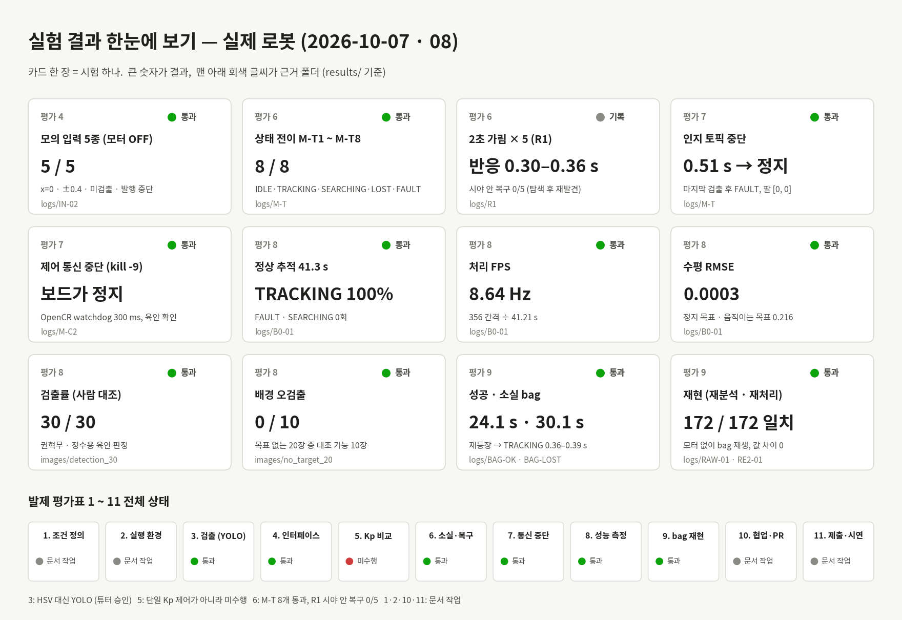

# 실험 결과 (평가표 4 · 6 · 7 · 8 · 9)



> 위 그림 한 장이 아래 1절 요약표와 같은 내용이다. 카드의 회색 글씨 = 근거 폴더 (`results/` 기준). 숫자를 고치면 `tools/experiment/make_summary_card.py` 를 다시 실행한다.

모든 결과는 **실제 로봇**(pa24) 기록이다. 큰 파일(bag · 영상)은 드라이브에 두고 [`../recordings/README.md`](../recordings/README.md) 에 파일명 · 크기 · sha256 · 링크를 적었다.
여기에는 원본 CSV · 상태 기록 · 판정 이미지 · 메타데이터만 둔다.

## 0. 공통 조건

| 항목 | 값 |
|---|---|
| 날짜 | 2026-10-07 오후 (R1), 2026-10-08 (나머지) |
| 실험 | R1: 권혁무, 정수용 / 10/8: 권혁무, 정수용, 박준명, 김민식 (팀 4명 함께 진행) |
| 카메라 | RealSense D435, color 640×360 @30 fps, depth 424×240 → color 정렬 |
| 인지 | YOLO v4 (NCNN, 입력 320×192, 스레드 2), `/detection` (PointStamped: x=e_x, y=e_y, z=depth[m], **z=0 미검출**) |
| 판단 | `planning_master` 30 Hz, 입력 타임아웃 0.5 s, 미검출 3프레임 → SEARCHING, 검출 3프레임 → TRACKING, 탐색 0.8 rad/s × 3바퀴 |
| 제어 | `control_master` 50 Hz, 명령 타임아웃 0.3 s / OpenCR 펌웨어 watchdog 300 ms (`firmware/opencr_firmware/watchdog.cpp`) |
| 진단 | `health.enabled: true` (IN 시험만 카메라가 없어 끔) |
| 기준 코드 | 브랜치 `control_fault_inject_Kwonhyeokmu`(238e52b) + `planning_csv_log_Kwonhyeokmu`(94f856b). 로봇에는 git 이 없어 회차마다 `code_fingerprint.txt`(실행 코드 sha256)를 남김. 10/8 회차는 파일 11개 중 10개가 위 두 브랜치 병합본과, `tools/inject/mock_inputs.py` 는 이 결과 브랜치 파일과 일치. 단 `IN-01` 은 지문을 새로 만들기 전이라 10/7 지문(파일 6개, 커밋 c10c9b1) 이 그대로 복사됐다. 10/7 R1 은 파일 6개가 커밋 c10c9b1 과 일치 |
| 시각 | bag 수신 시각 (각 bag 의 첫 `/tracking_status` = 0 s). 촬영→구동 지연이 아님 |

기록 방식 (명령은 [`../tools/experiment/`](../tools/experiment/))
- bag: `start_bag_inject.sh <RUN>` (상태 · 검출 · 명령 · control · 진단), `start_bag_jpeg.sh` (+ 컬러 JPEG 5 fps), `start_bag_rgb.sh` (+ 원본 컬러 · depth)
- planning CSV: `planning_master -p csv_log:=results/logs/planning_<RUN>.csv -p run_id:=<RUN>` (제어 주기마다 1줄, 열: run_id, time_s, frame_id, detected, ex, ey, depth_m, state, reason, …, cmd_v, cmd_w, arm_pan_cmd, arm_tilt_cmd, command_unit)
- control CSV: `control_master` 가 자동 기록 (`control_<날짜시간>.csv`, 목표 · 실제 바퀴 속도, 팔 명령 · 실제 각도, IMU, odom)
- 재계산: `python3 tools/experiment/analyze_1008.py {transitions|inputs|tracking|replay} <bag>` (노드 실행 없이 bag 만 읽음)

## 1. 결과 요약

| 평가 | 시험 | 결과 | 판정 | 근거 (`logs/`) |
|---|---|---|---|---|
| 4 | 모의 입력 5종 (모터 OFF) | x=0 → ω 0 · x=+0.4 → ω −0.20 · x=−0.4 → ω +0.20 · z=0 → 첫 프레임 정지 · 발행 중단 → 0.505 s FAULT | ✅ | `IN-02/` (`IN-01/` 조건 미충족) |
| 6 | 상태 전이 M-T1 ~ M-T8 | 8개 전이 모두 판정 기준 충족 | ✅ | `M-T/` |
| 6 | 2초 가림 × 5 (R1) | 반응 0.30 ~ 0.36 s, 탐색 후 재발견. 시야 안 재등장 복구 0/5 | 기록 | `R1/` |
| 7 | 인지 토픽 중단 (M-C1) | M-T7: 마지막 검출 0.509 s 뒤 FAULT, 속도 0, 팔 [0, 0] | ✅ | `M-T/SC-01b/` |
| 7 | 제어 통신 중단 (M-C2) | control_master `kill -9` → 보드 watchdog 으로 바퀴 정지 (육안) | ✅ | `M-C2/` |
| 8 | 30 초 정상 추적 (M-B0) | 41.3 s, TRACKING 100 %, FAULT · SEARCHING 0, 처리 FPS 8.64 Hz, 수평 RMSE 0.0003 (정지 목표) | ✅ | `B0-01/` |
| 8 | 움직이는 목표 추적 (참고) | 24.1 s, TRACKING 100 %, 처리 FPS 6.05 Hz, 수평 RMSE 0.216 | 참고 | `BAG-OK/` |
| 8 | 검출률 (30프레임 대조) | 30 / 30 = 100 % | ✅ | `../images/detection_30/` |
| 8 | 배경 오검출 (목표 없는 프레임 대조) | 목표 없는 20프레임 중 대조 가능 10프레임 → 잘못 검출 0회 | ✅ | `../images/no_target_20/` |
| 9 | 성공 장면 bag (M-BAG) | 24.1 s, 전부 TRACKING | ✅ | `BAG-OK/` |
| 9 | 소실 · 복귀 bag (M-BAGL) | 30.1 s, 재등장 → TRACKING 0.36 ~ 0.39 s (3회) | ✅ | `BAG-LOST/` |
| 9 | 결과 재분석 (M-RE1) | bag 만으로 재계산한 값이 성능표와 같음 | ✅ | `B0-01/` |
| 9 | 입력 재처리 (M-RE2) | 같은 촬영 시각 172 / 172 프레임 검출 일치, x · y · z 차이 0 | ✅ | `RAW-01/`, `RE2-01/` |

같은 값이 [`metrics.csv`](metrics.csv) 에 지표별로 있다.

## 2. 평가 4 — 모의 입력 5종 (`IN-02`)

조건: perception · 카메라 OFF, control 은 OpenCR 연결 후 팔을 정면 [0°, 0°] 로 맞춘 다음 실행 중 `motor_enable=false`, planning 진단 OFF.
입력: `tools/inject/mock_inputs.py` 가 `/detection` 에 20 Hz 로 48 s 동안 순서대로 발행 (z = 0.4 m = 추종 거리, 구간 시작마다 `/inject/event`).

| 입력 | 기대 | 결과 (planning CSV · bag) |
|---|---|---|
| IN1 x=0, z>0 | 불필요한 회전 없음 | TRACKING, ω 0.000, v 0.000 |
| IN2 x=+0.4 | 오른쪽 오차를 줄이는 명령 | ω −0.20 rad/s (시계) + 팔 pan 명령 −7.0° |
| IN3 x=−0.4 | 반대 방향 | ω +0.20 rad/s + 팔 pan 명령 +6.8° |
| IN4 z=0 | 이전 목표를 쫓지 않고 정지 | 첫 미검출 프레임에 v=0, ω=0 → 3번째 프레임(+0.121 s) SEARCHING |
| IN5 발행 중단 | 타임아웃 후 정지 | 마지막 수신 0.505 s 뒤 FAULT `detection_timeout`, v=ω=0, 팔 [0, 0] |
| 복귀 | 연속 3프레임 | 첫 검출 0.138 s 뒤 TRACKING |

- 모터 OFF 확인: control CSV 의 바퀴 실제 속도 0.000, 팔 실제 각도 변화 없음.
- `IN-01`: 팔이 pan −13.9°, tilt +33.7° 인 채 모터를 꺼서 x=0 이 몸통 정면이 아니었다 (IN1 ω −0.096). 조건 미충족으로 남기고 `IN-02` 로 재시험.
- SEARCHING 이후 ω +0.8 은 선택 기능(시야 밖 탐색)이다. 정지 자체는 첫 미검출 프레임에서 했다.

## 3. 평가 6 · 7 — 상태 전이 M-T1 ~ M-T8 (`M-T/`)

한 번 실행에서 순서대로 진행 (SC-01: M-T1~6, 중간에 녹화가 끊겨 SC-01b: M-T7~8). 진단 ON.

| ID | 전이 | 판정 기준 | 측정 | 판정 |
|---|---|---|---|---|
| M-T1 | IDLE → TRACKING | 연속 3프레임 | 3프레임, 0.26 s | ✅ |
| M-T2 | SEARCHING → TRACKING | 1바퀴 안 | 7.87 s, 회전 361° | ✅ |
| M-T3 | SEARCHING → TRACKING | 3바퀴째 검출 | 16.53 s, 765°, 검출 순간 팔 tilt +68.9° | ✅ |
| M-T4 | SEARCHING → LOST | 약 23.6 s, 회전 정지 | 23.47 s, 1081°, 명령 v=ω=0, 바퀴 0.41 s 감속 정지 | ✅ |
| M-T5 | LOST → IDLE | 팔 [0, −15°] ±1° | 0.90 s, 팔 실제 [−0.09°, −14.77°] | ✅ |
| M-T6 | IDLE → TRACKING | 연속 3프레임 | 3프레임, 0.28 s | ✅ |
| M-T7 | TRACKING → FAULT | 0.5 s 뒤, 속도 0, 팔 [0, 0] | 0.509 s, v=ω=0, 팔 tilt −27.2° → −0.1° (실제 이동) | ✅ |
| M-T8 | FAULT → IDLE | 항상 IDLE 먼저, 2 s 표시 | IDLE → 0.77 s 뒤 TRACKING, `recovered_from` 약 2 s | ✅ |

- M-T7 · 8 의 사유: 진단 ON 이라 `detection_timeout` 직후 `camera_diag_timeout` → `recovered_from:camera_diag_error`. 정지 동작은 같다.
- M-T4 탐색 중 1프레임 검출이 있었지만 3프레임 규칙으로 TRACKING 으로 가지 않았다.
- CSV: `planning_SC-01*.csv` 는 같은 파일에 이어 써서 bag 시작 전 준비 구간도 들어 있다. bag 구간 (`bag_metadata.yaml` 의 시작 · 길이) 으로 잘라 본다. CSV 와 bag 의 전이 시각 차이는 6 ms 이내.
- 영상: `M-T01.mp4` ~ `M-T08.mp4` (자막 수치는 bag 분석값, 영상 시각 맞춤 ±0.5 s) → [`M-T/video_README.md`](logs/M-T/video_README.md)

## 4. 평가 6 — 2초 가림 × 5 (`R1/`, 2026-10-07 14:24 ~ 14:32)

[`logs/R1/README.md`](logs/R1/README.md). 5회 모두 가림 0.30 ~ 0.36 s 뒤 SEARCHING, 탐색 회전으로 퍽에서 멀어졌다가 약 8 s 뒤 재발견.
재발견 후 TRACKING 복귀 0.33 ~ 0.50 s (R1-05 는 첫 z>0 이 1프레임 깜빡임이라 정의대로면 4.39 s).
**시야 안 재등장 복구는 0/5** — 탐색 후 재발견을 시야 안 복구로 세지 않는다. R1-01 은 팀 판단으로 통계에서 제외 (사유 미기재, `runs.csv`), R1-06 은 가림 전 FAULT 로 invalid 의심.
자동 요약(`summary.json`)은 `tools/experiment/analyze_run.py` 로 다시 만들었고 `runs.csv` 의 수동 값과 같다.

## 5. 평가 7 — 제어 통신 중단 (`M-C2/`)

[`logs/M-C2/README.md`](logs/M-C2/README.md). 바퀴를 띄우고 0.5 rad/s 회전 중 `kill -9` 로 control_master 종료 (Ctrl+C 는 종료 시 정지 명령을 보내므로 쓰지 않음, USB 는 기구상 분리 불가).
마지막 상태 수신 후 회전 명령 163개가 계속 발행됐지만 OpenCR 로 전달되지 않았고 바퀴는 즉시 정지 (육안). 정지까지 걸린 시간은 측정하지 않음.

## 6. 평가 8 — 성능 측정

**정상 추적 30 s (`B0-01`, 정지 목표)** — [`logs/B0-01/README.md`](logs/B0-01/README.md)

| 지표 | 산식 · 분모 | 값 |
|---|---|---|
| FAULT · SEARCHING | 상태 전이 | 0 |
| 유효 추적 비율 | TRACKING 제어 주기 / 전체 | 100 % (1238 / 1238) |
| 처리 FPS | `/detection` 수신 간격 수 / 첫 ~ 마지막 수신 시간 (카메라 설정 30 fps 와 구분) | 8.64 Hz (357개 → 356 간격 / 41.21 s) |
| 수평 RMSE | √mean(ex²), 검출 · TRACKING 프레임 | 0.0003 (358 / 358, 제외 0) |

정지 목표 · 정지 로봇이라 RMSE 가 거의 0 이다. 움직이는 목표는 아래 `BAG-OK` 참고.

**움직이는 목표 (`BAG-OK`, 24.1 s, 참고)**: 손에 든 퍽을 좌우 · 상하로 움직이고 마지막에 바닥에 둠. TRACKING 100 %, FAULT · SEARCHING 0, 처리 FPS 6.05 Hz (JPEG 기록 부하 포함), 수평 RMSE 0.216 (146 / 146 프레임, ex −0.52 ~ +0.50).

**검출률 · 배경 오검출 (사람 대조)** — 판정: 권혁무 · 정수용 육안 (2026-10-08)
- 검출률: `BAG-OK` 의 TRACKING 구간에서 JPEG 와 `/detection` 의 촬영 시각이 정확히 같은 34프레임 중 고르게 30장 → **30 / 30 올바른 검출 (100 %)**. 목록 · 판정: [`images/detection_30/OK_30_judge.csv`](images/detection_30/OK_30_judge.csv), 이미지 `OK_xx_raw.jpg` / `OK_xx_mark.jpg`(검출 중심 십자 표시)
- 배경 오검출: **검출기 출력을 보지 않고** `BAG-LOST` 의 JPEG 150장 전체를 시트로 보고 퍽이 안 보이는 프레임을 사람이 골랐다 → 23장, 원본 확인에서 퍽 일부가 보인 3장(F076 · F103 · F144) 제외 → **목표 없는 20프레임**.
  - 영상(JPEG 5 fps)과 검출(약 6 Hz)은 서로 다른 순간에 찍힌다. 그래서 영상과 가장 가까운 `/detection` 의 촬영 시각 차가 **카메라 1프레임(33 ms) 이내인 10장만 대조** → **잘못된 검출 0회 (0 / 10)**.
  - 나머지 10장은 가장 가까운 검출이 67 ~ 167 ms 떨어져 대조하지 않았다. 그중 F106 · F142 는 가장 가까운 검출이 z>0 이지만, 133 · 167 ms 앞의 퍽이 보이던 장면 (F105 · F141 과 같은 depth) 의 검출이라 오검출로 세지 않는다.
  - 판정 표: [`images/no_target_20/NT_judge.csv`](images/no_target_20/NT_judge.csv) · `NT_sheet.jpg`, 선정 근거 (150장 시트 · 전체 목록): `images/no_target_20/selection/`, 제외 3장: `images/no_target_20/excluded/`
- 노드 출력의 detected 비율은 사람 대조 검출률과 따로 본다.

## 7. 평가 9 — bag 기록 · 재현

| bag | 내용 | 결과 |
|---|---|---|
| `BAG-OK` (성공) | 원본 53.6 s 중 TRACKING 구간 24.1 s 를 `BAG-OK_success_trim` 으로 잘라 냄 (앞부분은 bag 시작 순간 기록 부하로 진단 FAULT · IDLE) | 전부 TRACKING |
| `BAG-LOST` (소실 · 복귀) | 30.1 s. 박스로 퍽 가림 → 재등장, 마지막에 퍽 치움. 미검출 → SEARCHING → 재검출이 3회 | 첫 미검출 후 정지 명령 0.008 ~ 0.038 s, 재등장 → TRACKING 0.387 · 0.355 · 0.357 s, 마지막 1프레임 재검출은 3프레임 규칙으로 복귀 안 함 |

두 재현의 차이: **결과 재분석**은 bag 에 저장된 출력(상태 · 명령 · 검출 결과)으로 지표만 다시 계산하는 것이고, **입력 재처리**는 bag 의 입력(카메라 영상)을 검출기에 다시 넣어 같은 출력이 나오는지 보는 것이다. 저장된 결과를 보기만 한 것은 재처리가 아니다.

**결과 재분석 (M-RE1)**: `analyze_1008.py tracking <B0-01 bag>` 로 bag 만 읽어 재계산 → FAULT · SEARCHING 0, TRACKING 100 %, 8.64 Hz, RMSE 0.0003 으로 성능표와 같다 (RMSE 분모 357 은 bag 의 `/detection` 수, 성능표 358 은 planning CSV 프레임 수).

**입력 재처리 (M-RE2)**: `RAW-01` (카메라 + perception 만, 원본 컬러 · depth 20.8 s) 의 영상만 perception 에 다시 넣어 별도 토픽 `/target_replay` 로 출력. control 은 켜지 않음 (모터 출력 없음).

```bash
# 로봇, 각 창: cd ~/lv2_module5 && source /opt/ros/lyrical/setup.bash && source ros2_ws/install/setup.bash
M=$(ros2 pkg prefix perception)/share/perception/models/target_blue_v4_192
ros2 run perception perception_master --ros-args --params-file config/perception.yaml \
  -p model_param:=$M/model.ncnn.param -p model_bin:=$M/model.ncnn.bin -p model_onnx:=$M/model.onnx \
  -p output_topic:=/target_replay -p use_sim_time:=true -p usb_check:=false
ros2 bag record -e '^/target_replay$' -o RE2-new          # 새 결과는 새 폴더에
ros2 bag play bags/RAW-01 --clock -r 0.3 --topics /camera/camera/color/image_raw /camera/camera/aligned_depth_to_color/image_raw
# 비교 (PC): python3 tools/experiment/analyze_1008.py replay bags/RAW-01 RE2-new   (기록본: bags/RE2-01)
# bags/ = 드라이브 폴더 (../recordings/README.md)
```

결과: 원본 `/detection` 187, 재처리 537 (0.3 배속이라 더 많은 프레임 처리), 같은 촬영 시각 172 프레임 **검출 · 미검출 172 / 172 일치, x · y · z 차이 0**.
저장된 `/detection` 과 새 결과는 다른 토픽으로 나눠 섞지 않았다.

**재현 확인**: 권혁무, 정수용, 박준명, 김민식 (2026-10-08, 함께 실행) — 위 명령으로 결과 재분석 · 입력 재처리를 실행해 성능표와 같은 값을 확인. 기준 코드는 0절.

## 8. 한계

- **원본 영상 bag 기록 부하**: 라즈베리파이에서 control · planning 과 함께 원본 컬러 + depth (약 35 MB/s) 를 기록하면 CPU 90 % 이상, 메시지 손실 (최대 1215개), 진단 FAULT 가 났다. 그래서 성능 bag 은 영상 없이 (`B0-01`), 판정용 영상은 JPEG 5 fps (`tools/inject/jpeg_tap.py`), 재처리용 원본은 카메라 + perception 만 켠 상태 (`RAW-01`) 로 나눠 기록했다. 실패한 시도는 지웠다.
- `B0-01` 은 정지 목표라 RMSE 가 작다. 움직이는 목표의 RMSE (0.216) 는 동일 조건 반복이 아니다.
- 검출률 30프레임은 한 장면 (실내, 1 m 이내, 파란 퍽) 기준이다.
- 배경 오검출은 목표 없는 20프레임 중 영상 · 검출 시각이 카메라 1프레임 이내로 맞는 10프레임만 대조했다 (발제 최소 10프레임). 영상을 5 fps 로만 저장해 같은 순간의 검출과 짝이 맞는 프레임이 적다.
- M-C2 정지 시간은 측정하지 않았다 (육안 + 펌웨어 300 ms 설정).
- R1 은 시야 밖 탐색 후 재발견이며 시야 안 재등장 복구는 0/5 다.
- `/detection` 의 `header.stamp` 는 RealSense 가 `HARDWARE_CLOCK` 경고를 내므로 촬영→구동 지연 계산에 쓰지 않았다.
- 평가 3 의 세 장면 (같은 설정): 정상 = `images/detection_30/`, 목표 없음 · 가림 = `images/no_target_20/` (손으로 가린 장면 포함), 일부 가림 = `images/no_target_20/excluded/`. 검출기는 HSV · Contour 가 아니라 YOLO 다 (튜터 승인).
- `BAG-LOST` 는 30.1 s 로 발제 권장 10 ~ 30 s 보다 0.1 s 길다.
- 노드 출력 · 인터페이스가 발제와 다른 점: 토픽 `/detection` (발제 `/target`), z = depth[m] (발제 면적비), 검출기 YOLO (발제 HSV · Contour, 튜터 승인).
