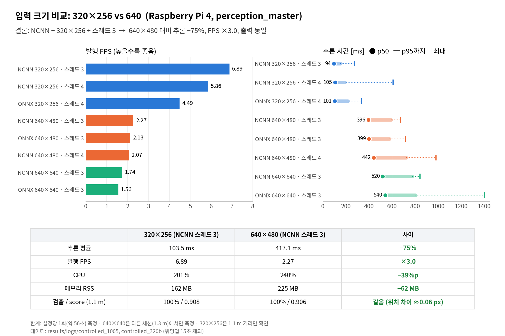

# 입력 크기 비교 요약: 320x256 vs 640 (Raspberry Pi 4)

상세 측정 조건과 원본 수치는 [realtime_ncnn_vs_onnx.md](realtime_ncnn_vs_onnx.md) 2절·2.6절을 본다. 아래 값은 `results/logs/controlled_1005`, `controlled_320b` CSV에서 워밍업 15초를 빼고 다시 계산했다.

## 결론
**NCNN + 320x256 + 스레드 3**을 쓴다. 640x480보다 추론이 4배 빠르고 출력은 같다.

| | 320x256 (NCNN t3) | 640x480 (NCNN t3) | 차이 |
|---|---|---|---|
| 추론 평균 | **103.5 ms** | 417.1 ms | −75% |
| 발행 FPS | **6.89** | 2.27 | ×3.0 |
| CPU | 201% | 240% | −39%p |
| RSS | 162 MB | 225 MB | −62 MB |

## 핵심
- **속도**: 같은 세션·스레드 4끼리도 131 vs 467 ms(−72%)로, 픽셀 수 비율(3.75배)과 비슷하다.
- **정확도**: 약 1.1 m에서 검출 100%, score·ex·z 모두 같다(ex 차이 약 0.06 px).
- **스레드**: 320x256에서 스레드 4는 3보다 느리고(131 vs 104 ms) 흔들림도 3배다. 카메라 노드와 CPU를 다툰다.
- **다음 병목**: 320x256은 프레임마다 35~100 ms를 color·depth 짝을 기다리는 데 쓴다. depth 정렬과 ROS 동기화(ApproximateTime)는 PC 실험으로 원인에서 제외했다. Pi에서 카메라 토픽이 실제로 15 Hz로 오는지 확인이 필요하다.

## 한계
- 설정당 1회(약 56초) 측정.
- 640x640은 다른 세션(퍽 1.3 m)에서만 측정.
- 320x256은 1.1 m 거리만 확인. 2~3 m 검출 여부는 미확인.
