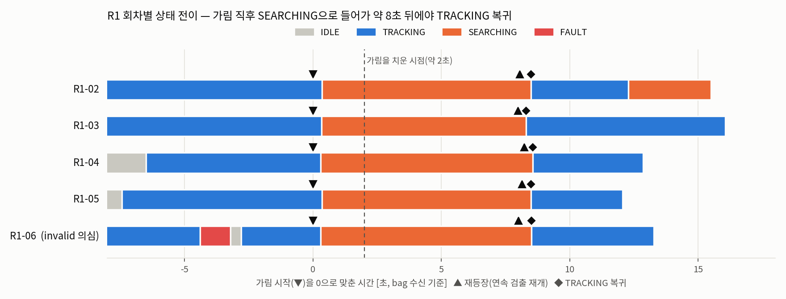
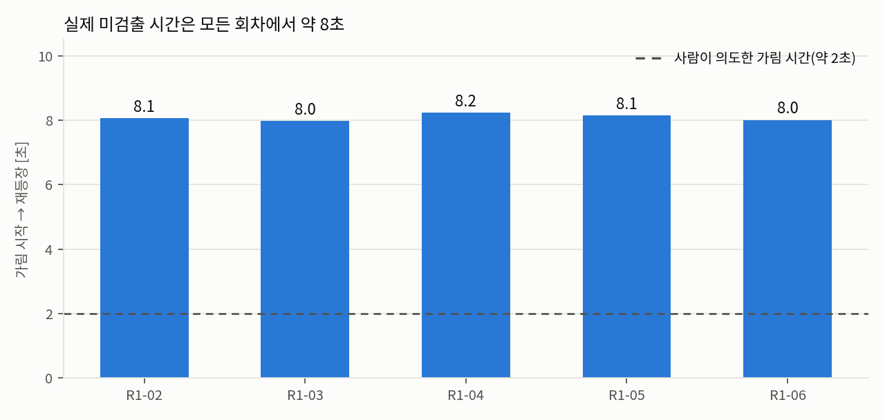

# M-R1 실험 결과 — 2초 가림 후 재등장 (실제 로봇)

> 작성 2026-10-07 · 기준 코드 `c10c9b1` (로봇은 git 저장소가 없어 `code_fingerprint.txt`의 sha256 6개가 c10c9b1과 일치함을 확인) · 실제 로봇 `pa24`
> 시각은 **bag 수신 시각**이며 planning 내부 시각이 아니다(수신 지연 포함, "촬영→구동 지연" 아님). 판정은 아래 "판정 기준별" 표로 정리한다.

## 1. 시험 조건

| 항목 | 값 |
|---|---|
| 시험 ID | M-R1 (`R1-02` ~ `R1-06`, `R1-01`은 제외) |
| 목표 | 퍽 1 m 앞, 매 회차 같은 위치 |
| 절차 | TRACKING 후 5초 대기 → 퍽을 약 2초 가림 → 같은 자리에서 재등장 → 3초 이내 TRACKING 복귀 여부 |
| 설정 | `bringup.launch.py` 기본 옵션, `planning.yaml` 기본값(미검출 3프레임 → SEARCHING, 검출 3프레임 → TRACKING) |
| 입력 | `/detection` 약 6~7 Hz |
| 기록 | `ros2 bag record` (`/detection`, `/tracking_status`, `/planning/cmd_vel`, `/planning/arm_command`, `/control/joint_states`, `/control/imu`, `/control/odom_yaw_deg`) |

## 2. 측정 결과 (초, 가림 시작이 아니라 bag 시작=0 기준)

| 회차 | 가림 시작 | SEARCHING 진입 | 반응 지연 | 재등장(첫 z>0) | 재등장(연속 재개) | TRACKING 복귀 | 복귀−재등장(첫 z>0) | 가림~재등장(연속) |
|---|---|---|---|---|---|---|---|---|
| R1-02 | 10.81 | 11.16 | 0.35 | 18.87 | 18.87 | 19.30 | 0.43 | 8.1 |
| R1-03 | 13.66 | 14.00 | 0.34 | 21.64 | 21.64 | 21.97 | 0.33 | 8.0 |
| R1-04 | 13.80 | 14.10 | 0.30 | 22.03 | 22.03 | 22.37 | 0.34 | 8.2 |
| R1-05 | 8.78 | 9.14 | 0.36 | 12.87 | 16.92 | 17.27 | 4.39 | 8.1 |
| R1-06 (invalid 의심) | 15.73 | 16.04 | 0.31 | 23.74 | 23.74 | 24.24 | 0.50 | 8.0 |

## 3. 산식

- **가림 시작** = 첫 TRACKING 이후, SEARCHING 전이 직전의 연속 미검출(`z=0`) 구간이 시작된 `/detection` 시각
- **반응 지연** = SEARCHING 전이 시각 − 가림 시작 (미검출 3프레임이 쌓이는 시간)
- **재등장(첫 z>0)** = 가림 시작 이후 처음 나온 `z>0` `/detection` (계획서 정의)
- **재등장(연속 재개)** = 이후 `z>0`가 3프레임 연속 나오기 시작한 첫 시각 (참고)
- **복귀−재등장** = TRACKING 복귀 시각 − 재등장 시각
- **복구 성공률** = (재등장 후 3초 이내 TRACKING 복귀 횟수 / 5) × 100, 복구 시간 = 복귀 − 재등장, 실패는 0초가 아니라 "실패"

## 4. 그래프

## 5. 해석

1. **가림 직후 SEARCHING에 들어가 회전했다.** 5회 모두 반응 지연은 약 0.3~0.4초이고, 이후 탐색 회전(0.8 rad/s)으로 퍽에서 멀어졌다. 미검출은 약 8초 지속됐는데 한 바퀴 회전 시간(2π/0.8 ≈ 7.85초)과 거의 같다. 사람이 가림을 치운 뒤에도 퍽이 시야에 없어서 한 바퀴 돌아 다시 본 것이다.
2. **복귀−재등장은 0.3~0.5초로 짧다.** 3프레임 연속 검출(약 6.5 Hz에서 0.3~0.5초)만 기다리면 되기 때문이다. 이 값은 "가림을 치운 뒤" 시간이 아니라 "탐색 중 퍽을 다시 본 뒤" 시간이다.
3. **시야 안 재등장 복구와 시야 밖 탐색 성공을 분리해야 한다(계획서 G11).** 5회 모두 탐색 후 재발견이므로 시야 안 재등장 복구로 세지 않는다.
4. **R1-05는 재등장 정의가 모호하다.** 첫 `z>0`(12.87초)은 1프레임 깜빡임이고 연속 검출은 16.92초부터다. 정의 그대로면 4.39초(3초 초과), 연속 재개 기준이면 0.35초다.
5. **R1-06은 invalid로 볼 근거가 있다.** 가림 전 11.34초에 `FAULT`(`mcu_diag_timeout`)가 났고, TRACKING 재개(12.94초) 후 2.8초만에 가려 "5초 대기" 조건이 깨졌다.

### 복구 성공률 (판정 기준별)

| 읽는 방법 | 3초 이내 | 성공률 |
|---|---|---|
| 계획서 정의(첫 z>0), 5회 모두 포함 | R1-02, 03, 04, 06 | 4/5 = 80% |
| 위에서 R1-06 제외(invalid) | R1-02, 03, 04 | 3/4 = 75% |
| R1-05를 연속 재개 기준으로 | R1-02~06 | 5/5 = 100% |
| 시야 안 재등장 복구로 세는 회차 | — | 0/5 (전부 탐색 후 재발견) |

## 6. 한계

- control CSV가 아직 없어 "정지 확인(실측)"은 하지 않았다.
- 마지막 reason은 실험자 메모에 없고, bag에서는 복귀 후 전부 `ok`였다.
- 영상(RGB)은 R1 회차에 기록하지 않았다.
- 가림을 치운 시각은 bag에 없다(사람이 약 2초로 구두 기록).
- 시뮬레이터가 아니라 **실제 로봇** 결과이며, 시험 중 메시지 유실 경고(10개)가 있었다(회차 미기재).

## 7. 원본 위치

- bag: 드라이브 `bags/R1-0N/` (`../../../recordings/README.md`)
- 분석: `R1-0N/timeseries.csv`, `events.csv`, `summary.json`
- 회차 요약: `runs.csv`, 서술: `R1-0N/note.md`
