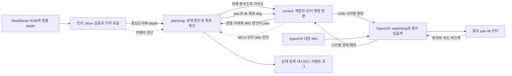
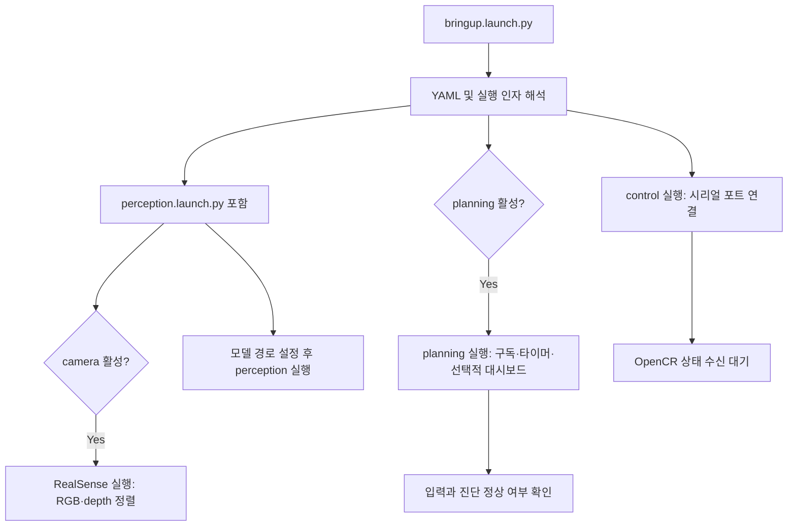
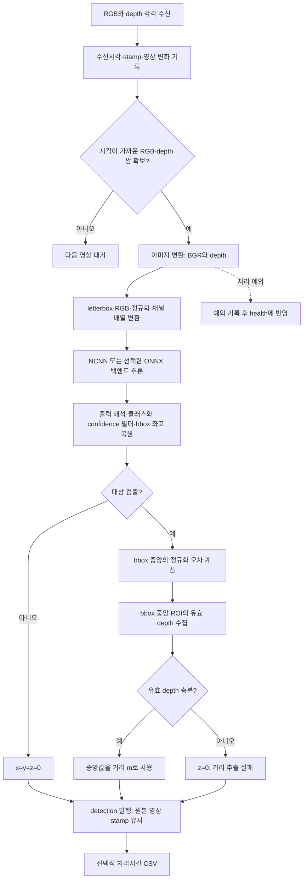
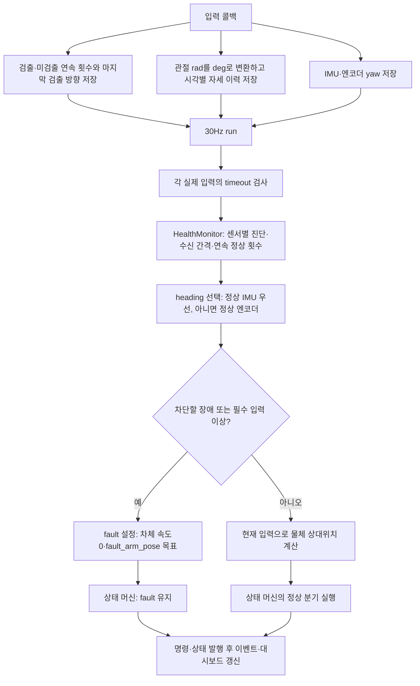
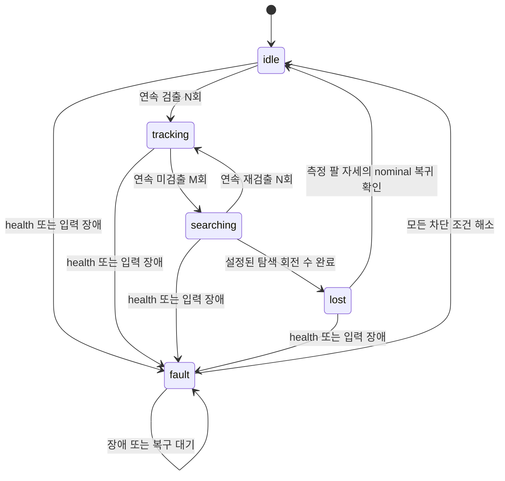
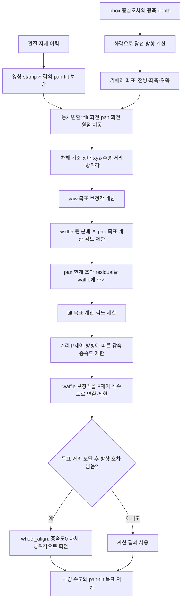
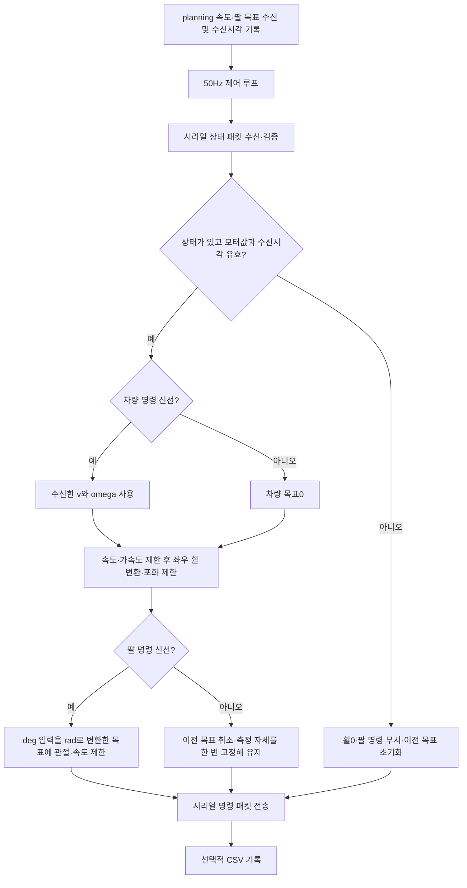
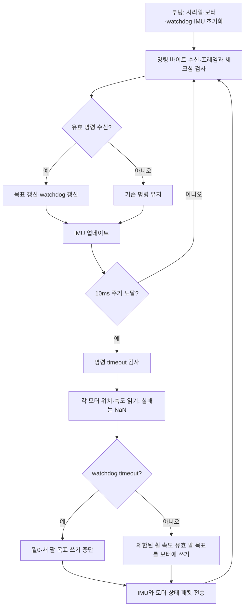

# 기능 기반 코드 리뷰 지도

기준: 2026-10-06 로컬 작업 트리. 실행 코드의 기능·분기·데이터 방향을 정리한 1차 리뷰 문서다. 실기 검증 결과나 설계 제안이 아니다. Mermaid를 지원하는 Markdown 미리보기에서 차트를 볼 수 있다.

## 1. 전체 시스템 — 누가 무엇을 하는가

각 노드는 동시에 실행된다. 아래 화살표는 프로그램 호출 순서가 아니라 데이터 이동이다. 인지는 물체를 관측하고, planning은 목표를 결정하며, control은 구동 명령으로 변환한다. OpenCR은 하드웨어 입출력을 맡는다.

| 구간 | 실제 인터페이스 | 의미 |
|---|---|---|
| 인지 → planning | `/detection`, PointStamped | x/y: 정규화 중심오차, 오른쪽/아래 양수. z: 광축 depth m, 0 미검출 |
| planning → control | `/planning/cmd_vel`, Twist | linear.x m/s, angular.z rad/s |
| planning → control | `/planning/arm_command`, Float32MultiArray | pan/tilt 절대 목표 deg |
| control → planning | `/control/joint_states`, JointState | 관절 이름별 rad를 planning에서 deg로 변환 |
| control → planning | `/control/imu`, Imu | yaw 쿼터니언과 각속도 |
| control → planning | `/control/odom_yaw_deg`, Float32 | 엔코더 기반 heading deg |
| 인지 → planning | `/perception/camera_health`, DiagnosticStatus | 영상 수신·정지·동기화·처리 오류 |
| control → planning | `/control/opencr`, `/control/arm_motor_health`, `/control/wheel_motor_health`, `/control/imu_health` | 각 장치 DiagnosticStatus |
| planning → 관찰 도구 | `/tracking_status`, String | 상태·원인·선택된 heading |

## 2. 실행과 초기화

- 기본 경로: `launch/bringup.launch.py` → `launch/perception.launch.py` 및 두 메인 노드.
- `pin_cpu=true`: 인지 코어1–3/NCNN 3스레드, 나머지 노드 코어0로 affinity 설정. 시스템 전체 코어 독점을 보장하지는 않는다.
- OpenCR 펌웨어는 별도 보드에서 이미 실행되어 있어야 한다. launch가 업로드하지 않는다.
- `motor_enable=false`는 control에서 휠0·팔 무시 명령을 전송한다.

## 3. 인지 — 영상에서 물체 관측값 생성

코드: `perception_master.cpp`의 `on_frames/process`, `detector.cpp`, `detector_factory.cpp`, `ncnn_detector.cpp`/`onnx_detector.cpp`, `depth_extractor.cpp`.

별도 health 타이머는 USB/드라이버 존재, color/depth 수신 단절, stamp·영상 반복, 동기화 실패, 최근 처리 예외를 검사한다. 미검출 자체는 카메라 고장이 아니다. 현재 단일 executor이므로 긴 추론 콜백은 health 타이머 실행도 지연시킬 수 있다.

## 4. Planning — 입력을 판단에 쓸 수 있는지 검사

실제 `run()`은 health 검사 후 fault여도 위치 계산 함수를 호출한다. 그림은 동작 결정에 영향을 주는 경로를 강조했다. fault에서는 상태 머신의 추종/탐색 계산을 실행하지 않는다.

진단 차단 우선순위: MCU → 팔 모터 → 휠 모터 → 카메라. IMU만 이상이면 엔코더로 대체 가능하다. 사용할 heading이 없거나 실제 입력이 무효/끊겼으면 차단한다. 정상 진단은 기본 연속3회가 필요하며, `health.enabled=false`여도 실제 입력 검사는 유지한다.

### 상태 전이

| 상태 | 차량 기능 | 팔 기능 | 주의할 분기 |
|---|---|---|---|
| idle | 정지 | nominal | N회 검출 시 다음 주기부터 tracking |
| tracking | 거리·방향 제어 | 시선 분배 목표 | 첫 미검출부터 차량 정지, M회 누적 후 searching |
| searching | 마지막 검출 방향으로 제자리 회전 | pan nominal, 회차별 tilt | 재검출 우선, yaw 증분 누적으로 회차 계산 |
| lost | 정지 | nominal 복귀 | 팔 오차가 허용 범위이면 idle |
| fault | 정지 | fault_arm_pose 발행 | 장애 해소 시 idle, 복구 원인 잠시 표시 |

현재 YAML: N=3, M=3, 탐색 tilt `[0, mid, max]` → `[0,34.5,69]°`. 회전 수는 tilt 목록 길이이므로 **현재 3바퀴**다. 과거의 '고정 두 바퀴·tilt 변경 없음' 설명과 다르다. `wheel_align`은 tracking 기능이며 상태가 아니다.

### Tracking 계산 흐름

주요 함수: `arm_pose_at`, `calc_cur_object_pos`, `calc_tracking_targets`, `calc_tgt_yaw_deg`, `distribute_tgt_yaw_deg`, `calc_tgt_pan_deg`, `calc_tgt_tilt_deg`, `calc_waffle_linear_vel`, `calc_waffle_angular_vel`, `wheel_align`.

보간할 기록이 없으면 최신 자세, 기록 시간 범위 밖이면 끝점 자세를 쓴다. 이 처리는 팔 자세 시각을 맞추는 것이며 영상 지연 동안의 차체 이동까지 보정하는 기능은 아니다.

## 5. Control — 목표를 실제 구동 명령으로 변환

시리얼 수신 경로는 IMU·관절·엔코더 odometry를 ROS 토픽으로 내보내 planning에 피드백한다. 별도 진단 타이머는 MCU 패킷 수신·송신 실패, 모터 유한값, IMU 유효성을 보고한다. 무효값과 무수신을 구분하는 로직은 `serial_rx()`와 `publish_health()`를 함께 읽어야 한다.

차량 명령 timeout은 가속도 제한을 거쳐 감속하는 경로이고, 모터 피드백 장애는 직접 휠0을 보내는 경로다. 팔 timeout은 torque off가 아니라 위치 유지다. `motor_enable=false`는 최종 시리얼 전송 단계에서 적용된다.

## 6. OpenCR — 실제 센서와 모터 입출력

`imu_reader`는 보정/준비 전 유효하지 않은 값을 NaN으로 전달한다. control은 사용할 수 없는 IMU를 진단하고 planning은 엔코더 heading으로 대체할 수 있다. 시리얼은 제어·펌웨어 양측 동일한 바이너리 규약을 쓴다. 모터 자체의 위치/속도 제어와 실제 추종 성능은 하드웨어 영역이다.

## 7. 코드 리뷰를 진행할 파일 순서

경로는 `lv2_module5/` 기준이다.

| 순서 | 파일/묶음 | 리뷰할 기능 |
|---|---|---|
| 1 | `launch/bringup.launch.py`, `launch/perception.launch.py`, `config/*.yaml` | 실행 대상, 파라미터 우선순위, CPU 배치 |
| 2 | `ros2_ws/src/perception/src/perception_master.cpp` | 영상 동기화, 출력 규약, health |
| 3 | 같은 경로 `detector.cpp`, `detector_factory.cpp`, `ncnn_detector.cpp`, `onnx_detector.cpp`, `depth_extractor.cpp` | 추론 전후처리, 후보 선택, 거리 실패 조건 |
| 4 | `ros2_ws/src/planning/planning/planning_master.py` | 입력 콜백 → 시간 정합 → 좌표 → 상태 → 목표 → 발행 |
| 5 | 같은 경로 `health_monitor.py`, `dashboard.py` | 장애 우선순위/복구, 화면과 기록 |
| 6 | `ros2_ws/src/control/src/control_master.cpp` | 명령 수신, 제어 주기, 진단, failsafe |
| 7 | 같은 경로 `base_kinematics.cpp`, `arm_command.cpp`, `serial_bridge.cpp` 및 `include/control/*.hpp` | 휠 운동학, 팔 제한, 시리얼 파싱 |
| 8 | `firmware/opencr_firmware/`의 ino, motor_driver, imu_reader, watchdog, serial_protocol | 실제 장치 입출력, 보정, 실패 검출, 패킷 규약 |
| 9 | 각 `CMakeLists.txt`, `package.xml`, planning `setup.py/setup.cfg` | 빌드 대상, 설치 경로, 실행 진입점 |

## 8. 메인 파이프라인 밖의 코드

이 문서는 메인 실행 경로를 먼저 설명한다. 저장소의 모든 실험 코드를 줄 단위로 검토했다는 의미는 아니다.

| 코드 | 역할과 연결 여부 |
|---|---|
| `ros2_ws/src/control/scripts/imu_driver.py` | IMU 전용 CSV 펌웨어 단독 시험용. 통합 바이너리 프로토콜 경로와 다름. control_master와 같은 포트 동시 사용 금지 |
| perception `imu_joint_reader.*` | 현재 구현 파일은 주석뿐이고 메인 CMake 소스 목록에 포함되지 않음 |
| `tools/sim/fake_perception.py`, `fake_control.py`, `fake_planning.py`, `sim_viz.py` | 모의 입력/노드/시각화. 기본 bringup 실행 대상 아님 |
| `tools/benchmark/`, perception `tools/detector_bench.cpp` | 추론 백엔드·성능 비교, CPU/메모리 기록. 실차 제어와 분리 |
| planning `test/test_health_integration.py` | planning 입력·진단·상태 동작 테스트 |
| 저장소 루트 `perception_test/yolo/` | 학습·데이터 준비·카메라 실험 코드. 배포 인지 노드와 분리해 리뷰 |
| `results/`, `report.md` | 실험/검증 기록. 현재 코드와 작성 시점이 다를 수 있음 |

IDE 탭에 보이는 `state_machine.py`, `planning_master_v2.py`, planning 폴더의 `imu_driver.py`는 이번 조사 시 해당 경로의 실제 파일 목록에 없다. 현재 실행 진입점은 `planning.planning_master:main`이며, 열린 탭 이름만으로 실행 경로에 포함하지 않았다.

## 9. 다음 상세 리뷰에서 확인할 경계

- 정상 미검출과 카메라 장애가 어떤 입력에서 구분되는가?
- 영상 stamp와 관절 이력은 동일한 시간 기준인가? 움직이는 차체의 지연은 얼마나 되는가?
- fault 팔 목표 발행과 control의 피드백 장애 차단 중 실제로 어떤 명령이 모터까지 도달하는가?
- 진단 복구 횟수와 검출/미검출 횟수는 루프 횟수가 아닌 메시지 횟수로 세는가?
- IMU↔엔코더 전환과 yaw wrap이 탐색 회전 누적에 미치는 영향은 무엇인가?
- 모델 추론 지연이 health 발행 및 0.5초 timeout과 충돌하는가?

이 항목들은 확인할 리뷰 질문이며, 모두 버그라고 판정한 것은 아니다.
